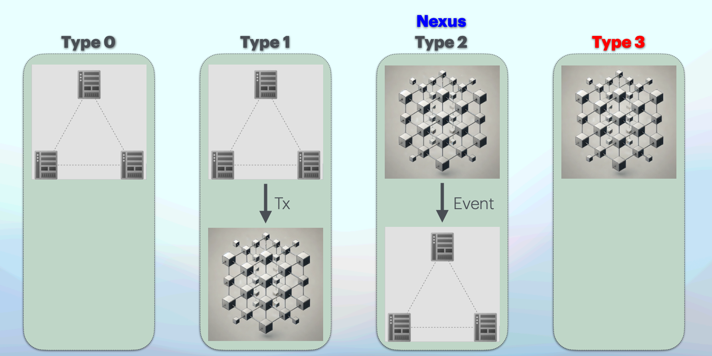

# AI Agent: What's in a Name?

Talus aims to build the premier platform to build and deploy AI agents in an open, transparent, censorship resistant, composable and secure manner. But… what do we actually mean when we say that? In fact, what do we mean when we talk about AI agents? With the hype surrounding them increasing, so too has the confusion and even misinformation. So before continuing, let’s clearly outline how we at Talus think about AI agents.


For the impatient among our readers, here’s a succinct version that summarizes the more detailed version in the rest of the section…


Succinct version:

Talus AI agents are AI Agents. That is to say, they are _compound AI systems that can automate one or multiple composable, complex tasks, usually originating from a human user intent but not bound to simply react to continuous input, instead proactively perceive their own environment, take actions autonomously to achieve goals and improve their performance by learning_.

At Talus however, we are more opinionated about AI agents. Nexus, our agentic framework, allows to build AI agents that comply with a specific type of implementation. They leverage _blockchain(s) as their coordination and value layer_, _decentralized storage solutions as their data layer_ while leveraging offchain (potentially centralized) _AI models and general web/mobile infrastructure as their computation and execution layer_. The latter, while performed offchain, are ideally verifiable onchain, following the ethos of decentralization.

This deliberately modular, layered architecture lets Talus AI agents inherit many of the desirable properties of each layer, optimizing its position in the trade-off design space (along the decentralization versus cost/performance spectrum).

### General AI Agent Definition

First and foremost, **Talus AI agents are… AI agents**. That is to say, Talus AI agents fall under the general umbrella term of AI agents and comply with the general understanding (despite _us being more opinionated_ on how these agents should be built, as we’ll discuss below).

AI Agents have rapidly become a fairly well established narrative in the AI sector, evolving out of foundational models (LLMs) that were, while impressive in their own right, rather narrow in their utility. AI agents or ‘agentic systems’ are the next step in the AI evolution, removing constraints for the LLM to perform a wider range of complex tasks with more tools available to it. An exact definition might differ from source to source ([Wikipedia](https://en.wikipedia.org/wiki/Intelligent_agent), [IBM](https://www.ibm.com/think/topics/ai-agents), [Amazon](https://aws.amazon.com/what-is/ai-agents/?nc1=h_ls), …) but we can summarize as follows:

**AI agents are compound AI systems with the following characteristics**:

* they can automate one or multiple composable, complex tasks;
* their tasks usually originate from a human user input, but they are not bound to constant (human) inputs to operate, rather…;
* they can take actions autonomously to achieve goals;
* they can plan and devise strategies to split up tasks in smaller actions;
* they can perceive and interact with their own environment;
* they can interpret their own performance;
* they can improve their performance by learning from their results.

**Some additional terminology that will aid general AI agent understanding:**

*   **`Workflow`**: a structured sequence of tasks or operations powered by tools that an AI agent or system of agents executes to achieve a specific goal. It's essentially the "playbook" that defines how agents should process information, make decisions, and take actions.

    A workflow typically includes:

    * The order and dependencies between tasks (what needs to happen before what)
    * Decision points where the agent evaluates conditions and chooses different paths
    * Input/output specifications for each step
    * Error handling and recovery procedures
    * Success criteria and completion conditions
*   **`Tool`**: functions or capabilities that agents can use to interact with external systems or perform specific tasks. They're essentially the atomic building blocks that enable agents to take concrete actions.

    Key aspects:

    * Tools have well-defined inputs and outputs
    * They perform specific operations (like web searches, calculations, or API calls)
    * They often interface with external services or resources
    * They can be composed into more complex workflows
    * They typically include error handling and usage constraints

    Common examples include text processing tools, mathematical operations, web access functions, file handling utilities, and API integrators.

So far, nothing new.

Based on the definition above, we could design AI agents that are closed-source, hard to compose or interoperate with other agents or external resources, have limited autonomy due to owner-imposed barriers, lack access to financial rails and in general, only operate within the walled gardens their centralized owners allow them to operate in. This is NOT the future we envision. At Talus, we are **more opinionated about AI agents**. But then, how can we formalize our classification of the agents we’ll encounter to ensure we take the path towards decentralization with AI agents?

### Agentic Frameworks: a Spectrum

AI agents that allow for complex tasks to be solved or complex multi-agent interactions, while incredibly useful to application builders, also present a challenge to design, build and deploy. To ensure that builders of the next wave of user applications on the internet can maximally focus on their application, frameworks can abstract away complexity and make development easier by providing out-of-the-box libraries, tooling and standards. This is what we call agentic frameworks, they allow to streamline the development of AI agents of all sorts.


An agentic framework provides the building blocks, architecture and foundational structure for developing, deploying, and managing agents and multi-agent systems.


Given how recent the development of AI agents is, there is not yet a formal categorization of those agentic frameworks, which opens the door for confusion and misinformation. The team at Talus has been leading the charge towards a classification.

We believe agentic frameworks (and thus the agents they allow to build) exist on a spectrum (in order of increasing decentralization):

* **Type 0**: agents that “live” and operate completely on centralized servers.
* **Type 1**: agents that “live” and operate mainly on centralized servers, but as part of their execution flow, have access to a wallet and submit transactions to a blockchain.
* **Type 2**: agents that are defined onchain with execution workflows that are verifiable onchain, but, for the sake of performance and cost-effectiveness, outsource (a part of) their execution offchain to service providers.
* **Type 3**: agents that are defined and operate completely onchain.

<figure><figcaption>
Agentic Frameworks as a Spectrum
</figcaption></figure>

At Talus, we believe that agentic frameworks should strive towards decentralization but within the bounds of the pragmatic. The emphasis should be on **verifiability onchain** (along with the agent’s workflow definition), rather than putting all agentic execution onchain at great cost/performance penalties.

**We are building Nexus** (developer framework to build Talus agents) **to occupy the Type 2 domain of the spectrum** where we leverage the open, censorship resistant and verifiable nature of the blockchain while keeping the overall workflow performant through outsourcing computation to offchain service providers. This is the first step to identify how Talus AI agents are different, but there’s more that we can specify to rigorously define them.

### Talus Agents

Talus (AI) agents power the next generation of the internet. They put users first and in control, _satisfying user intents_ while delegating the complex workload to efficient AI agents handling behind the scenes. By combining the cutting-edge technologies of AI and blockchain, Talus agents create empowering, innovative, and highly effective internet experiences. Open, transparent, censorship resistant, secure, composable, fair and with access to a native value layer.

**Nexus**, our agentic framework, allows developers a streamlined interface to build Talus agents by leveraging the best of the AI, blockchain and web technologies. The architecture design we implement for Talus agents (Type 2) has the following properties:

* **Blockchain as the coordination and value layer**. Defining agentic workflows “onchain” ensures agents inherit the blockchain’s desirable properties:
  * **Transparency and verifiability** of the autonomous agentic workflows to instill trust that user’s intents will be fulfilled in their interest.
  * **Censorship resistance** to ensure AI tools are not kept in a walled garden, accessible only to the privileged few.
  * **Composability and interoperability** to allow agent builders maximal expressivity without having to reinvent the wheel constantly. It allows composable agent-to-agent and multi-agent (swarms) interactions, as well as interaction with external digital resources (REST API services, databases, cloud providers, authentication services, and more).
  * **Access to financial rails** to enable authorized agents to make financial transactions for the user, benefitting from the same globally connected and near instantaneous decentralized financial infrastructure human users can (blockchains).
  * **Verifiable Ownership and Governance** to ensure true ownership (instead of proxy ownership, where a central party allows you partial ownership rights but ultimately holds crucial power) and enable clear, verifiable decentralized governance that can govern the rules of ownership and value coordination.
* **Decentralized data storage platform as the data layer.** Storing all but the crucial agent (meta)data on a decentralized storage platform, ensures agents and the applications leveraging them, inherit its desirable properties:
  * **Resilience** to avoid vulnerability to single points of failure, downtime, and control by a single entity. Decentralized storage ensures data remains accessible even if some nodes go offline.
  * **Censorship resistance** to make it difficult for any single entity to censor or restrict access to information.
  * **User data sovereignty** to ensure users retain full ownership and control over their data, rather than surrendering it to third-party providers.
  * **Cost-effective scalability** by tapping into a shared economy of storage.
* **State of the Art (SOTA) AI infrastructure as the computation layer.** In our roadmap towards progressive decentralization, we must concede that highly compute intensive components of the AI agent systems will remain (partially) centralized to remain competitive from a cost-performance perspective. We aim to make state of the art AI infrastructure (potentially centralized) available to the AI agent builder, which gives these properties:
  * **Empower the developer to make the trade-off according to their needs** by also providing access to potentially centralized AI compute, while keeping verifiability of the agent workflow onchain.
  * **Performance and cost parity** with entirely centralized, offchain agentic frameworks.

This deliberately modular, layered architecture lets Talus AI agents inherit many of the desirable properties of each layer, optimizing its position in the trade-off design space (along the decentralization versus cost/performance spectrum).
