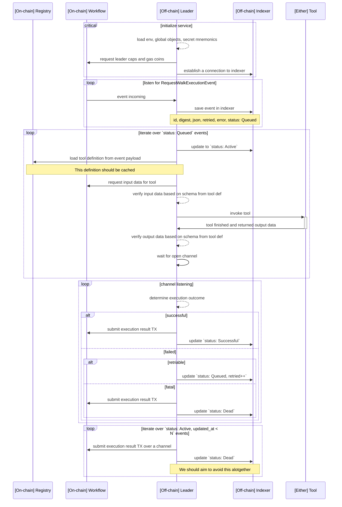
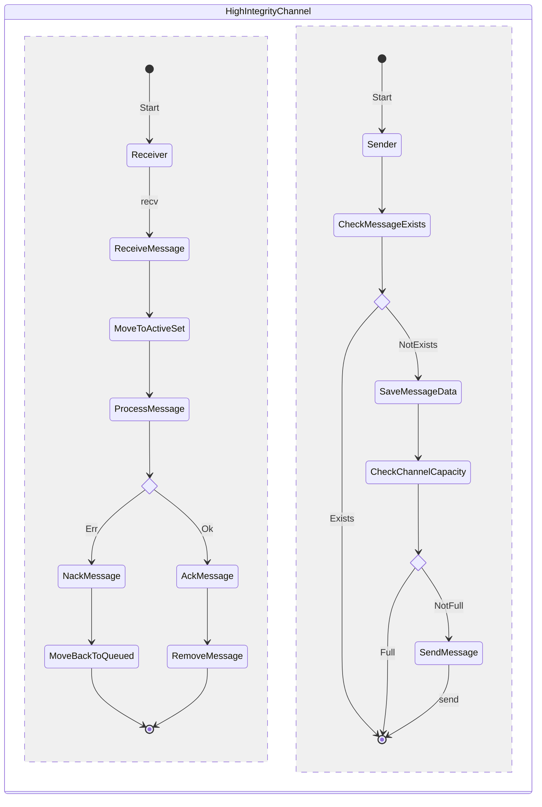
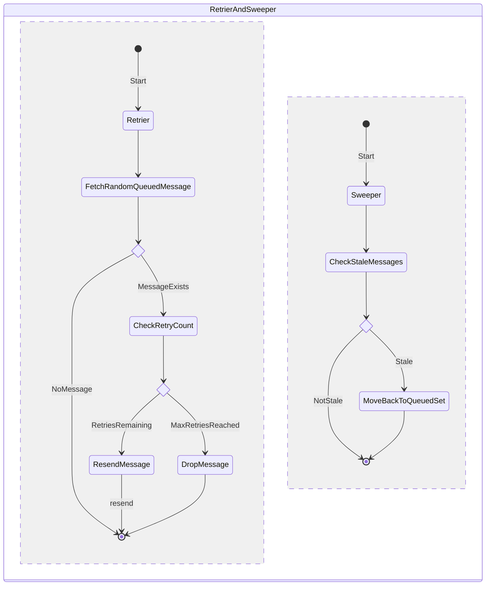

# Leader

## Sequence diagram

High-level sequence diagram describing the duties of the Leader.

## Processes

There are multiple processes running in parallel in the leader node. These are as follows:

1. **`RequestWalkExectuionEvent` listener**

- This process repeatedly queries Sui RPC for new events coming from the Workflow. It then saves these events on the Indexer.
- It persists the last visited cursor, a pointer to the event it has written to our Indexer last. This way we ensure no events are lost in case the Leader goes down.

2. **`Queued` events execution engine**

- This part of the Leader queries `status: Queued` events in order to invoke Tools specified on the event.
- Communicates with the Workflow to fetch input data for Tools.
- Communicates with the Tool Registry to fetch Tool schemas in order to validate its input data.
- Invokes Tools with the verified input data.
- Verifies output data from Tools based on its output schemas.
- Finally, it halts until a channel is open to send a TX back to Workflow (this can happen at any point during the execution if it errors).

3. **Workflow communication channel**

- N channels can run in parallel where N is the number of `leader_cap`s the Leader has available.
- Receives messages from the execution engine and evaluates the result. Depending on this, multiple outcomes can happen:
  - (a) `Successful` - TX to Workflow is sent and status is updated in Indexer to `Successful`. If TX fails, we have to block the channel for 24h.
  - (b.i) `Failed.Retriable` - Status is updated back to `Queued` and retires are incremented in Indexer.
  - (b.ii) `Failed.Fatal` - TX to Workflow is sent and status is updated in Indexer to `Dead`. If TX fails, we have to block the channel for 24h.

4. **Stale `Active` events disposal**

- Events that are still `Active` after a configured time has passed should be disposed of and marked as `Dead`.
- This should also notify Workflow via a TX.

## High integrity channel

Some parts of the Leader service use a custom channel implementation that handles indexing of messages sent over this channel, as well as retries and sweeps of stale messages.

Notably, the event listener<>event executor and the event executor<>merchant processes communicate via this channel.

The following state diagrams should highlight the functionality of the channel.


Note that this channel "assumes" it has a stable Redis connection. There are edge cases, where dropping events is very unlikely, but possible. One such edge case is if sending a message over this channel fails due to Redis being unavailable but the Sui event listener successfully saves the next page cursor to Redis. This can in the future be improved by handling Redis errors within the channel differently (by for example, halting).


### High integrity channel receiver and sender

### Retrier and sweeper processes

