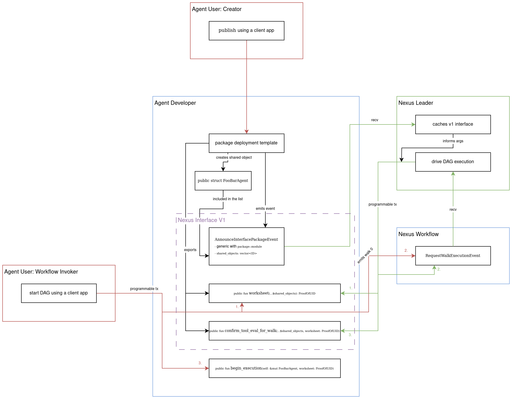

# Nexus Interface

Nexus components are designed to be composed into "Smart Agent Packages" (SAPs) that are published on Sui.
SAPs are typically template Sui packages that are customized for a specific product.
They would include business logic relevant to the product and configurations for the Nexus components.

The configurations typically take the form of `SuiObjectID`s which represent shared objects.
These shared objects, such as [`DAG`][packages-workflow], are unforced to be invoked in situations described by the business logic.

Some examples of what the business logic in a SAP could do:

- check token supply to feature-gate a workflow
- require a payment component
- require a minimal time elapsed between invocations
- reward OP for reaching some step in the workflow

## `V1`

Nexus first iteration is focused on the workflow component.
To comply with the Nexus V1 Interface the SAP must:

1. Register itself with the [Nexus leader][crates-leader] by emitting `nexus_interface::v1::AnnounceInterfacePackageEvent` that
   - has a generic parameter `W` which is a type located in the package and module that implements the interface.
   - contains property `shared_objects: vector<ID>` is a list of `SuiObjectID`s that the leader will inject as args into each following public function call.
     The list is ordered, that is the shared objects will be injected in the order they are listed.
2. Export `public fun worksheet(...${shared_objects}): ProofOfUID`
   - Returns a stamp collector hot-potato.
   - Collects execution confirmations by Nexus components such as `DAG`.
   - Hot potato must be constructed with a type.
     That can be achieved by calling `nexus_primitives::proof_of_uid::new_with_type`.
     This type must be defined in the package and module that implements the interface.
     Note that types don't change their type name when doing package upgrades.
3. Export `public fun confirm_tool_eval_for_walk(...${shared_objects}, ProofOfUID)`
   - Consumes the hot-potato.
   - Can verify that required confirmations have been collected.
   - Invoked by the Nexus Leader.

### Events

- `nexus_interface::v1::AnnounceInterfacePackageEvent`
  - has the aforementioned generic parameter `W`;
  - can be emitted many times by the same `W` in case the shared objects change, but delay should be tolerated between emitting this call and the BE syncing the changes;
  - `shared_objects` is a list of `SuiObjectID`s that the leader will inject as args into each following public function call;
  - when a package is upgraded, it must be called again with a newly published `W`

### Upgrades

Unfortunately, Sui does not give us a way to get current package ID.
When upgrading a package you must create a new type that serves as a witness.
This new type needs to be used when emitting `AnnounceInterfacePackageEvent` as its generic.
This event _also_ needs to be emitted with every package upgrade.

<!-- List of References -->

[packages-workflow]: ./Workflow.md
[crates-leader]: ../crates/Leader.md