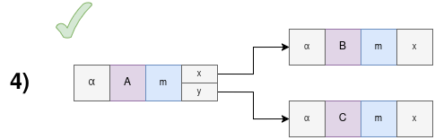
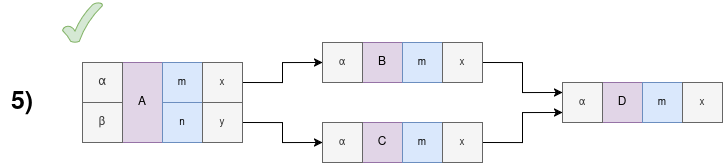
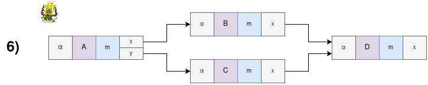
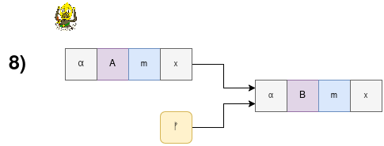

# Workflow Package

> concerns [`sui/workflow` package][repo-workflow-package]

This Sui package exports data structures and algorithms which orchestrate off-chain computation.
The workflow engine is an integral part of the on-chain control plane.

In a nutshell, the workflow engine executes walks over a directed acyclic graph (DAG) of `Vertex`s.

## Glossary

- An end state is a `Vertex` with no outgoing `Edge`s.

- A walk can either halt as _(i)_ successful, _(ii)_ failed, or _(iii)_ consumed.

  - _(i)_ successful halt means that the walk has reached an end state;
  - _(ii)_ failed halt means that the walk cannot reach an end state;
  - _(iii)_ consumed halt means that the walk has been joined with another walk.

- A successful execution is one where all walks halt in an end state.

- A partial execution is one where at least one walk halts in an end state.

- A failed execution is one where no walk halts in an end state.

- A default value is a value that is static with respect to walk execution. Think configurations.

- Entry group is a set of entry vertices that are executed concurrently when DAG is invoked.

- Default entry group is an entry group used when no entry group is specified.

## Rules

1. If a cycle is detected, the walk halts as failed.
2. DAG can have multiple entry points and multiple end states.
3. Relationships between `Vertex`s are encoded into `Edge`s.
4. An `InputPort` can either have an incoming `OutputPort` or a default value, but not both.
5. No `InputPort` can at runtime receive a value two different `OutputPort`s.
   - This rule can be translated to "no race conditions".
6. `N` edges from the identical `OutputVariantPort` will fork the walk into `N` concurrent walks.
7. DAG execution ends when all walks halt.
8. If a walk reaches an end state then it halts as successful.
9. Vertex is not scheduled for execution until all edges leading to it are evaluated.
10. If a walk reaches a vertex that cannot be immediately scheduled for execution then the walk halts as consumed.
11. Entry vertices can have default values which cannot be overridden by user input data.

> These rules are statically validated by the Nexus [[CLI]] if using JSON definitions of DAGs.

A tool is represented by a vertex in the DAG.
A tool has at least one input represented by input ports.
These are akin to arguments to a function.
A tool returns a first degree enumeration variant.
These are mutually exclusive descriptions of the tool's output.
A variant has at least one output represented by output ports.

---

This DAG has three vertices.
Once vertex `A` is done, the walk will fork into two concurrent walks, ie. vertex `B` and `C` will be executed concurrently.

---

Because output variants are mutually exclusive, only one of those two branches will be taken.
That means there's no race condition in this DAG.

---

This DAG is _UNACCEPTABLE_.
It violates the rule `5.`.
Because these two output ports are connected to the same input port on vertex `B`, there are two sources of data for one input port

---

This DAG demonstrates how one vertex can again branch into two concurrent walks.
This time, both walks were started from a different output port of the same output variant.

---

This DAG demonstrates that having two edges leading to the same input port is acceptable if they come from different output variants of the same vertex.
Only one path through the DAG can be taken at runtime and therefore there's no race condition to vertex `D`.

---

This DAG is _UNACCEPTABLE_.
It violates the rule `5.`.
Both walks will be spawned and therefore there's a race condition to vertex `D`.

---

Default values are great for static configuration.

---

This DAG is _UNACCEPTABLE_.
You cannot have a default value and an edge leading to the same input port.

### Validation

Most of our validation is done in form of static analysis and the on-chain realm just assumes that the DAG was constructed correctly.
If DAG ends up in a situation from which it cannot continue, it just halts.

More design and documentation regarding the static analysis to follow.

### Entry groups

A DAG can have multiple entry groups.
When beginning execution of a DAG the user must specify which entry group to use.
An entry group has one or more entry vertices.
All entry vertices in an entry group are executed concurrently.
Therefore, the user must provide data for all entry vertices in an entry group.

## Events

Events in our Nexus packages can contain these data types:

- `SuiObjectID`
  - a unique identifier for an object
  - can be used to fetch the object from the RPCs/GQL
- `Vertex`
  - a unique name of a vertex in a DAG
  - `{ name: String }`
- `VertexKind`
  - enumeration over the kind of vertices in a DAG
  - see [the `dag` module][repo-workflow-package-dag] for this type
- `InputPort`
  - a unique name of an input port in a vertex
  - `{ name: String }`
- `Edge`
  - unique path (at runtime) through the DAG
  - `{ from: { variant: String, port: String }, to: { vertex: String, port: String } }`
- `NexusData`
  - represents some data within Nexus framework
  - see [the `data` module][repo-primitives-package-data] for this type
- `VertexEvaluation`
  - represents what should be the inputs to a vertex
  - `{ ports_to_data: Map<InputPort, NexusData> }`

Then there are these events emitted and their conditions:

- `DAGCreatedEvent`
  - `dag: SuiObjectID`
  - emitted when a new DAG is created
  - our current typical usage is a shared object DAG
  - object not found should be just logged with `warn` and skipped because the
    DAG can also be a stored object technically, albeit our implementations will
    always share it
- `DAGEntryVertexAddedEvent`
  - `dag: SuiObjectID`
  - `vertex: Vertex`
  - `kind: VertexKind`
  - `input_ports: Vec<InputPort>`
  - emitted when a new entry vertex is added to a DAG
  - vertices cannot be removed so this is final
  - the `input_ports` are the input ports of the vertex _not including default values_
- `DAGVertexAddedEvent`
  - `dag: SuiObjectID`
  - `vertex: Vertex`
  - `kind: VertexKind`
  - emitted when a new vertex is added to a DAG
  - vertices cannot be removed so this is final
  - the input ports are determined by the edges and default values
- `DAGEdgeAddedEvent`
  - `dag: SuiObjectID`
  - `from_vertex: Vertex`
  - `edge: Edge`
  - emitted when a new edge is added to a DAG
  - edges cannot be removed so this is final
  - both from and to vertices must exist
  - if an edge leads to an input port it won't have a default value
- `DAGDefaultValueAddedEvent`
  - `dag: SuiObjectID`
  - `vertex: Vertex`
  - `port: InputPort`
  - `value: NexusData`
  - emitted when a default value is added to a vertex
  - if a default values is defined for an input port it won't have an edge
- `RequestWalkExecutionEvent`
  - `dag: SuiObjectID`
  - `execution: SuiObjectID`
    - shared object that contains the state related to one execution of the DAG
  - `walk_index: u64`
    - will be necessary when submitting the results
  - `next_vertex: Vertex`
    - this is the vertex that must be executed
    - to translate it to a tool use `VertexKind` on the vertex
  - `evaluations: SuiObjectID`
    - dynamic object field that can be queried to fetch data
  - emitted when a walk execution is requested
  - only one request per walk index will be emitted per tx
  - multiple concurrent walks can request execution in one tx
- `EndStateReachedEvent`
  - `dag: SuiObjectID`
  - `execution: SuiObjectID`
  - `walk_index: u64`
  - `vertex: Vertex`
  - `evaluations: SuiObjectID`
  - emitted when a walk reaches an end state, ie. a vertex that has no further
    outgoing edges
- `ExecutionFinishedEvent`
  - `dag: SuiObjectID`
  - `execution: SuiObjectID`
  - `has_any_walk_failed: bool`
  - `has_any_walk_succeed: bool`
  - emitted when no more work needs to be done for this execution

## Leader cap

The leader cap(_ability_) is an owned object given to the [leader][crates-leader] wallet.
With this object the leader authorizes itself to submit tool outputs to the workflow.

The leader cap can be cloned and given to other wallets, or multiple times to the same wallet.
This is desirable if parallel txs are submitted to the workflow to prevent equivocation related errors.

## Tool registry

The tool registry is an on-chain shared object that holds [tool definitions][tool-definitions].

To register a tool the creator must deposit a time-locked collateral to prevent spamming the registry.
The amount of `SUI` locked and the interval after which they can be reclaimed is configured in the `nexus-next` repo.

## Notes

- We have considered a stricter rule `5.` where `InputPort` can have only one incoming `OutputVariantPort`.
  However, relaxing this rule into its current form meant expressive workflows and simpler runtime state management in exchange for more complex static analysis algorithm.
  This trade-off was deemed worthy.
- When using the [`ProofOfUid` primitive][repo-primitives-package-data], it must be created with a type that matches the `UID`.
  The type should be considered an authorization ticket and should be treated just as any other capability type.

<!-- List of references -->

[repo-workflow-package]: https://github.com/Talus-Network/nexus-next/tree/main/sui/workflow
[repo-workflow-package-dag]: https://github.com/Talus-Network/nexus-next/tree/main/sui/workflow/sources/dag.move
[repo-primitives-package-data]: https://github.com/Talus-Network/nexus-next/tree/main/sui/primitives
[tool-definitions]: ../Tool.md#tool-definitions
[crates-leader]: ./crates/Leader.md