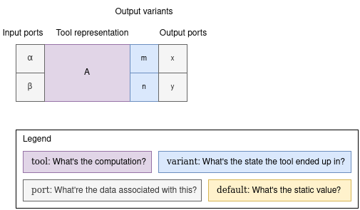
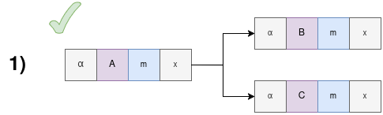
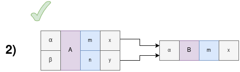
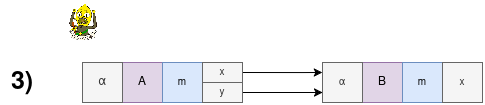
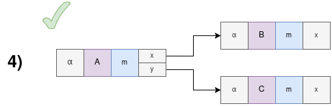
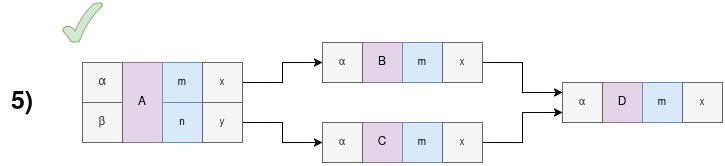
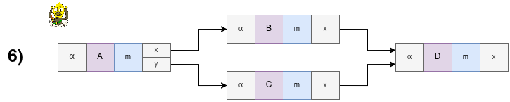
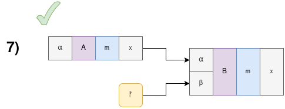
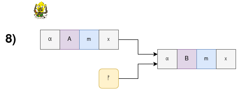

# Workflow Package

This Sui package exports data structures and algorithms which orchestrate offchain computation.
The workflow engine is an integral part of the onchain control plane.

In a nutshell, the workflow engine executes walks over a directed acyclic graph (DAG) of `Vertex`s that represent Nexus Tools.


The terms used in the context of the DAG can be found in the [glossary](../glossary.md#dag-related-terms). Familiarize yourself with them before moving on.


 Mental model for Nexus Tools as the workflow vertices

* A tool is represented by a vertex in the DAG.
* A tool has at least one input represented by input ports.
* These input ports are akin to arguments to a function.
* A tool returns a first degree enumeration variant.
* These are mutually exclusive descriptions of the tool's output.
* An output variant has at least one output represented by output ports.



## Properties of Nexus DAG design

- An end state is a `Vertex` with no outgoing `Edge`s.

- A walk can either halt as _(i)_ successful, _(ii)_ failed, or _(iii)_ consumed.

  - _(i)_ successful halt means that the walk has reached an end state;
  - _(ii)_ failed halt means that the walk cannot reach an end state;
  - _(iii)_ consumed halt means that the walk has been joined with another walk.

- A successful execution is one where all walks halt in an end state.

- A partial execution is one where at least one walk halts in an end state.

- A failed execution is one where no walk halts in an end state.

- A default value is a value that is static with respect to walk execution. Think configurations.

- An output variant is the resulting _state_ of a Tool evaluation. A Tool can define N Output Variants but will always evaluate into exactly 1 at runtime.

- All specified entry ports for all vertices within an entry group must receive data to start execution. Vertices listed without any ports are executed immediately if they have no other input dependencies.

- A default entry group is used when no specific group name is provided during execution initiation. All entry ports are assumed to be part of the default entry group.

## Rules

1. If a cycle is detected, the walk halts as failed.
2. DAG can have multiple named entry points (`EntryGroup`s) and multiple end states.
3. Relationships between `Vertex`s are encoded into `Edge`s.
4. An `InputPort` can either have an incoming `OutputPort`, default value or client input as an entry port. These options are mutually exclusive.
5. An `InputPort` receiving a value from an `OutputPort` at runtime must receive a value from exactly one `OutputPort`.
   - This rule can be translated to "no race conditions and no unreachable vertices"
6. `N` edges from the identical `OutputVariantPort` will fork the walk into `N` concurrent walks.
7. DAG execution ends when all walks halt.
8. If a walk reaches an end state then it halts as successful.
9. Vertex is not scheduled for execution until all edges leading to it are evaluated.
10. If a walk reaches a vertex that cannot be immediately scheduled for execution then the walk halts as consumed.
11. Input ports designated as part of an `EntryGroup` cannot have default values. Default values are only permitted for input ports that are _not_ part of any entry group.


These rules are statically validated by the [Nexus CLI](../../nexus-sdk/cli.md) if using JSON definitions of DAGs.


---

This DAG has three vertices.
Once vertex `A` is done, the walk will fork into two concurrent walks, ie. vertex `B` and `C` will be executed concurrently.

---

Because output variants are mutually exclusive, only one of those two branches will be taken.
That means there's no race condition in this DAG.

---

This DAG is _UNACCEPTABLE_.
It violates the rule `5.`.
Because these two output ports are connected to the same input port on vertex `B`, there are two sources of data for one input port

---

This DAG demonstrates how one vertex can again branch into two concurrent walks.
This time, both walks were started from a different output port of the same output variant.

---

This DAG demonstrates that having two edges leading to the same input port is acceptable if they come from different output variants of the same vertex.
Only one path through the DAG can be taken at runtime and therefore there's no race condition to vertex `D`.

---

This DAG is _UNACCEPTABLE_.
It violates the rule `5.`.
Both walks will be spawned and therefore there's a race condition to vertex `D`.

---

Default values are great for static configuration.

---

This DAG is _UNACCEPTABLE_.
You cannot have a default value and an edge leading to the same input port.

### Validation

Most of our validation is done in form of static analysis and the onchain realm just assumes that the DAG was constructed correctly.
If DAG ends up in a situation from which it cannot continue, it just halts.

More design and documentation regarding the static analysis to follow.

### Reserved output variants

Output variants are usually evaluated by vertices (tools) in the DAG. However, a tool can be broken, unreachable or there can be other issues with invocation. The workflow reserves these output variants to evaluate into if this happens.

Currently, the workflow engine reserves the following output variants:

- `_err_eval`: Error when evaluating a Tool, this output variant is used in the following scenarios:
  1. Tool is not registered or there was another issue fetching the tool's FQN
  2. Default values could not be fetched for the tool
  3. Tool definition could not be fetched
  4. Input data for the tool does not pass the tool's validation schema
  5. Tool invocation failed
  6. Output data could not be parsed or does not pass the tool's validation schema

### Entry ports

Entry ports are input ports that must receive data from the client before execution can begin. These ports are explicitly defined via `with_entry_port` or `with_entry_port_in_group`. They cannot have any default values or incoming edges.

Key characteristics of entry ports:

- They must be provided with data when starting DAG execution
- They cannot have default values assigned to them
- They are defined as part of an entry group configuration
- Multiple entry ports can be defined for a single vertex
- Entry ports help define valid starting states for DAG execution

For example, if a vertex `A` has input ports `x` and `y`, and port `x` is designated as an entry port in the default entry group, then:

- Port `x` must receive data from the client before execution can start
- Port `x` cannot have a default value
- Port `y` can optionally have a default value or receive data via an edge
- The DAG execution will not begin until port `x` receives its required input data

This mechanism allows DAGs to enforce specific initialization requirements while maintaining flexibility in how other inputs are handled during execution.

### Entry groups

A DAG can define multiple named `EntryGroup`s, each specifying a distinct starting configuration.

When initiating a DAG execution, the user must select an `EntryGroup` by name (or use the default one if none are explicitly defined).

An `EntryGroup` consists of a set of vertices.

To start the execution via a specific entry group, the user must provide input data for each _entry port_ of each vertex included in the entry group. If a vertex has no entry ports, the vertex name _must_ still be specified with an empty `VecMap` of entry ports.

Vertices included in an entry group but with an _empty_ set of input ports will be scheduled for execution immediately at the start, provided they don't have any incoming edges. If a vertex in this case _does_ have incoming edges, this is a no-op - it has no effect on the execution and the vertex is treated as-if it was not included in the entry group.

A default entry group (named `_default_group`) is available for convenience.

## Events

Events in our Nexus packages can contain these data types:

- `SuiObjectID`
  - a unique identifier for an object
  - can be used to fetch the object from the RPCs/GQL
- `Vertex`
  - a unique name of a vertex in a DAG
  - `{ name: String }`
- `VertexKind`
  - enumeration over the kind of vertices in a DAG
  - see the `dag` module for this type
- `InputPort`
  - a unique name of an input port in a vertex
  - `{ name: String }`
- `Edge`
  - unique path (at runtime) through the DAG
  - `{ from: { variant: String, port: String }, to: { vertex: String, port: String } }`
- `NexusData`
  - represents some data within Nexus framework
  - see the `data` module for this type
- `VertexEvaluation`
  - represents what should be the inputs to a vertex
  - `{ ports_to_data: Map<InputPort, NexusData> }`

For a list of all event types, refer to [the reference docs for the Workflow package](./reference/nexus_workflow/dag.md).

## Leader cap

The leader cap(_ability_) is an owned object given to the [leader](../crates/leader.md) wallet.
With this object the leader authorizes itself to submit tool outputs to the workflow.

The leader cap can be cloned and given to other wallets, or multiple times to the same wallet.
This is desirable if parallel txs are submitted to the workflow to prevent equivocation related errors.

## Tool registry

The tool registry is an onchain shared object that holds [tool definitions](../tool.md#tool-definitions).

To register a tool the creator must deposit a time-locked collateral to prevent spamming the registry.
The amount of `SUI` locked and the interval after which they can be reclaimed is configured in the `nexus-next` repo.

## Notes

- We have considered a stricter rule `5.` where `InputPort` can have only one incoming `OutputVariantPort`.
  However, relaxing this rule into its current form meant expressive workflows and simpler runtime state management in exchange for more complex static analysis algorithm.
  This trade-off was deemed worthy.
- When using the `ProofOfUid` primitive, it must be created with a type that matches the `UID`.
  The type should be considered an authorization ticket and should be treated just as any other capability type.
