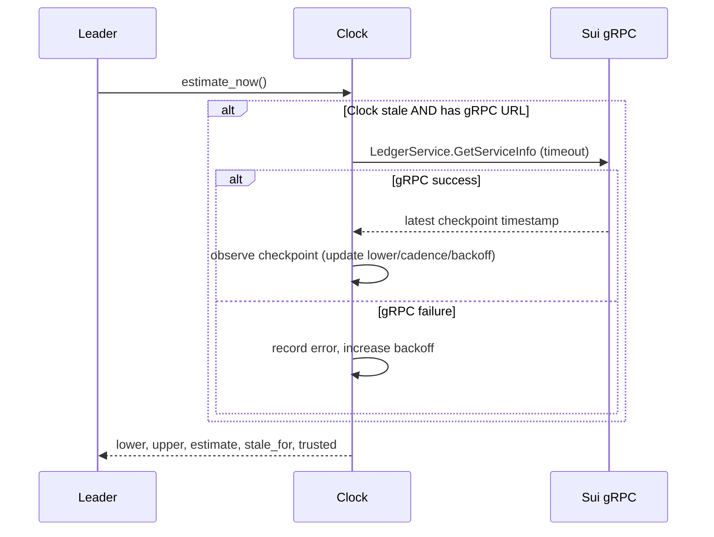
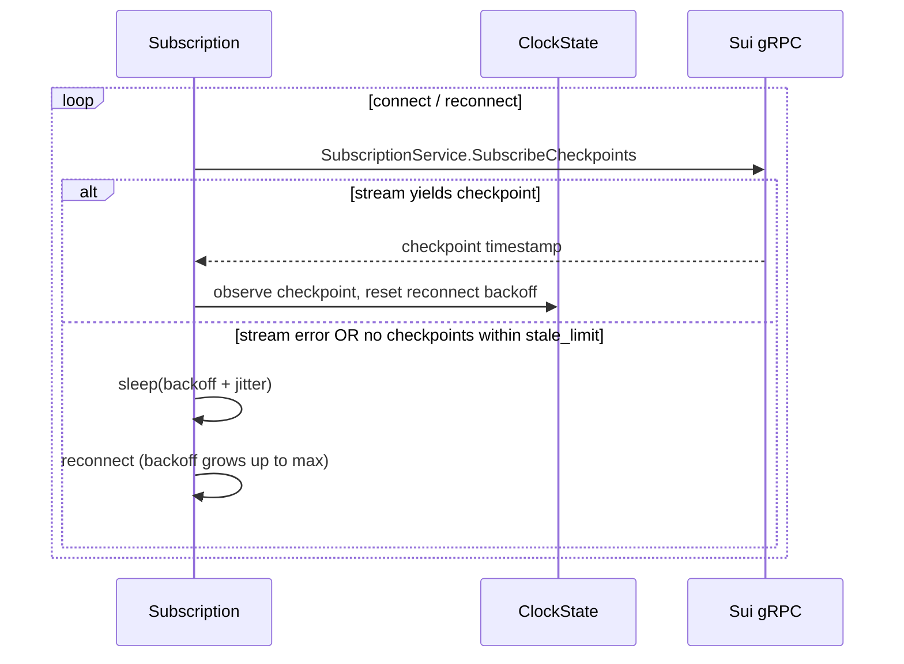

# Leader Checkpoint Clock

A conservative, monotonic view of on-chain time derived from Sui checkpoints. Used by the leader to gate time-sensitive work against Sui’s notion of “now,” not the host clock.

## Problem

- Actors (users, Sui chain, leader) have different clocks. Time-sensitive operations (TTLs, scheduling, expirations) must align with Sui, since both users and leader interact directly with the chain.
- Relying on the host clock risks skew: expired TTL checks, misordered work, or race conditions.

## Design

- **Source of truth:** Sui checkpoint timestamps.
- **State:** `lower_ms` (last checkpoint), `upper_ms` (drift cap), `estimate_ms` (monotonic within bounds), `stale_for_ms`, `trusted`.
- **Drift bounding:** `headroom_ms_cap` and cadence EMA + slack prevent advancing faster than the chain typically progresses. When stale + `Hold` fallback, drift stops.
- **Monotonicity:** Atomic `fetch_update` ensures estimates never regress, even if caps shrink after fast checkpoints.
- **Staleness:** If no checkpoint within `stale_limit`, mark untrusted and (if enabled) trigger a refresh. Unseeded clocks are treated as stale to force seeding.
- **Refresh paths:**
  - **Background subscription:** `SubscriptionService.SubscribeCheckpoints` stream; reconnects on errors or when no checkpoint is observed within `stale_limit`.
  - **On-demand refresh (stale):** `LedgerService.GetServiceInfo` (returns the latest executed checkpoint timestamp) with a timeout.
- **Trust boundary:** Inputs to `record_checkpoint`/streams are assumed trusted; gRPC fetch/subscription are trusted. Add validation at ingestion if untrusted sources appear.

## Sequence: Client Uses On-Chain Time

## Sequence: Background Subscription

## Operational Notes

- **Config:** Non-zero poll jitter; refresh timeout; headroom/slack tuned to checkpoint cadence; stale fallback (`Headroom` vs `Hold`) per risk tolerance.
- **Observability:** Metrics for refresh attempts/success/failure and cadence gauge; tracing on refresh outcomes labeled (`manual` vs `subscription`).
- **Testing:** Time/RNG injectable for deterministic tests; coverage for monotonicity, drift cap, staleness, backoff, cadence rounding, seeded/unseeded behavior.

