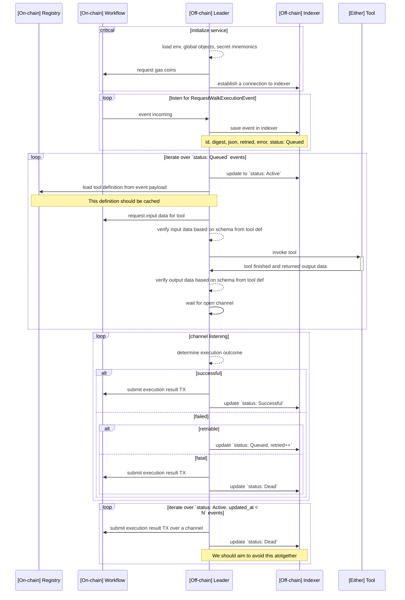
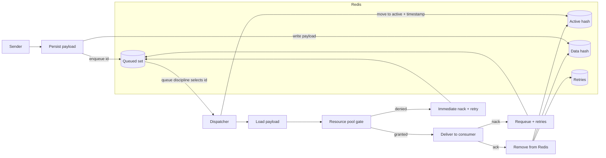
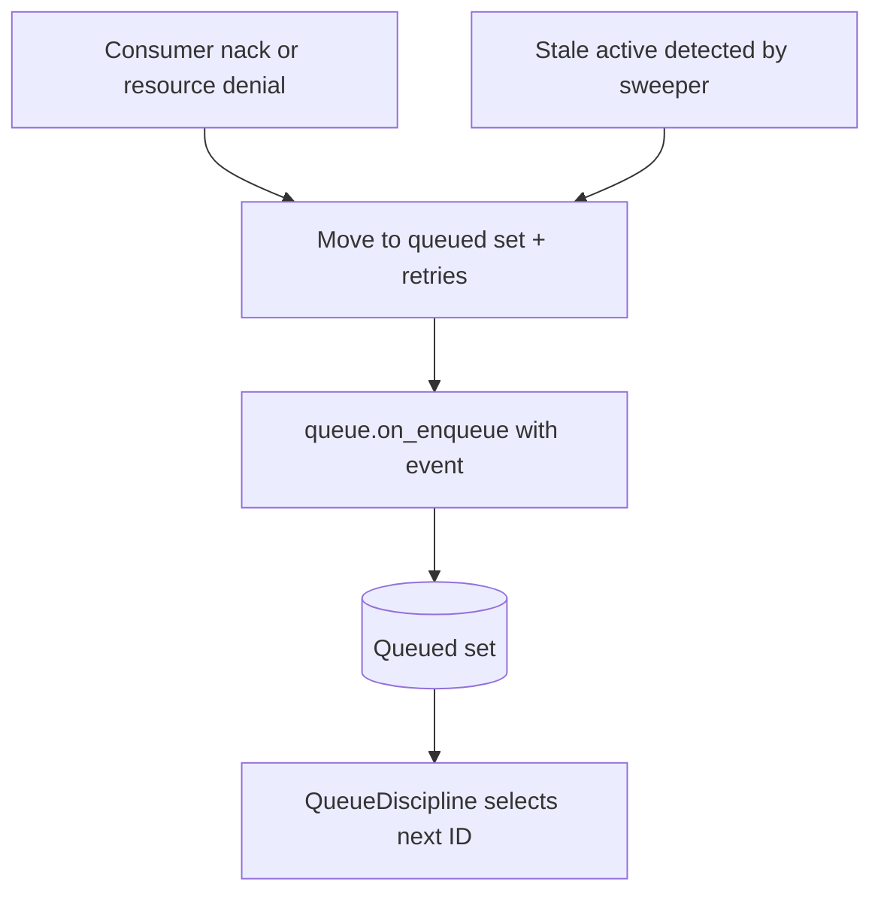

# Leader

## Sequence diagram

High-level sequence diagram describing the duties of the Leader.

## Processes

There are multiple processes running in parallel in the leader node. These are as follows:

1. **`RequestWalkExecutionEvent` listener**

- This process repeatedly queries Sui RPC for new events coming from the Workflow. It then saves these events on the Indexer.
- It persists the last visited cursor, a pointer to the event it has written to our Indexer last. This way we ensure no events are lost in case the Leader goes down.

1. **`Queued` events execution engine**

- This part of the Leader queries `status: Queued` events in order to invoke Tools specified on the event.
- Communicates with the Workflow to fetch input data for Tools.
- Communicates with the Tool Registry to fetch Tool schemas in order to validate its input data.
- Invokes Tools with the verified input data.
- Verifies output data from Tools based on its output schemas.
- Finally, it halts until a channel is open to send a TX back to Workflow (this can happen at any point during the execution if it errors).

1. **Workflow communication channel**

- N channels can run in parallel where N is the number of `Coin<SUI>` objects the Leader has available.
- Receives messages from the execution engine and evaluates the result. Depending on this, multiple outcomes can happen:
  - (a) `Successful` - TX to Workflow is sent and status is updated in Indexer to `Successful`. If TX fails, we have to block the channel for 24h.
  - (b.i) `Failed.Retriable` - Status is updated back to `Queued` and retires are incremented in Indexer.
  - (b.ii) `Failed.Fatal` - TX to Workflow is sent and status is updated in Indexer to `Dead`. If TX fails, we have to block the channel for 24h.

1. **Stale `Active` events disposal**

- Events that are still `Active` after a configured time has passed should be disposed of and marked as `Dead`.
- This should also notify Workflow via a TX.

## Checkpoint clock (time sync)

A checkpoint-driven clock provides the leader with a conservative, monotonic view of on-chain time to gate time-sensitive work. It derives bounds from Sui checkpoints, caps drift by observed cadence/headroom, surfaces staleness, and refreshes via gRPC when stale.

- [Checkpoint clock details](./leader-checkpoint-clock.md)

## High integrity channel

Some parts of the Leader service use a custom channel implementation that handles indexing of messages sent over this channel, as well as retries and sweeps of stale messages. Notably, the event listener<>event executor and the event executor<>merchant processes communicate via this channel.

### Why queue discipline and resource gating
- Avoid head-of-line blocking when a queued item cannot run (shared-object locks, external rate limits, or missing resources).
- Let domains swap in their own ordering policy without touching channel internals.
- Prevent wasted retries by dispatching only when capacity for the payload exists.

### Architecture (policy + gate inside the channel)

**QueueDiscipline** is the abstraction that decides what queued item is delivered next. Policies can derive hints from the payload, keep bookkeeping in Redis, and observe lifecycle hooks:
- Hooks: `on_enqueue` (new, nack, sweep), `select_for_delivery`, `on_deliver`, optional `on_nack`, and `on_remove`.
- The default policy selects a random queued ID; swapping policies does not change the channel core.

**ResourcePool** (optional) gates dispatch after the payload is loaded. Payloads implement `ResourceTagged` to declare claims (kind + quantity). If the pool denies the request, the channel immediately nacks and tries another queued item; guards are released on ack/nack/drop.

**Dispatcher + receiver**: a semaphore enforces the configured capacity. The dispatcher asks the queue discipline for the next ID, activates it, loads the payload, consults the resource pool, and delivers `(payload, handle, retries)` to consumers. The handle’s `ack`/`nack` remove or requeue the message (data, active, retries) and notify the queue discipline.

**Persistence surface**: Redis stores queued IDs, active IDs with timestamps, payload data, and retry counters. Metrics track delivery latency and in-flight counts.


Note that this channel "assumes" it has a stable Redis connection. There are edge cases, where dropping events is very unlikely, but possible. One such edge case is if sending a message over this channel fails due to Redis being unavailable but the Sui event listener successfully saves the next page cursor to Redis. This can in the future be improved by handling Redis errors within the channel differently (by for example, halting).


### Retry and sweep
- `nack` (consumer) or resource denial moves the ID back to the queued set, increments retries, and fires `on_enqueue` with the appropriate event.
- The sweeper periodically scans active messages; stale entries are nacked, `on_enqueue` is invoked with a sweep event, and the dispatcher is woken up.

