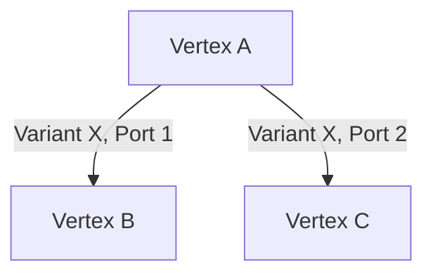
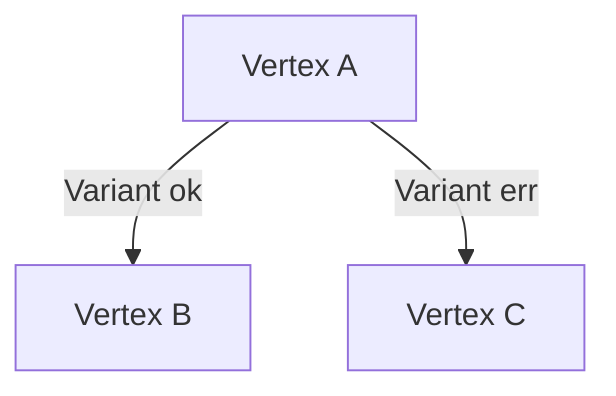
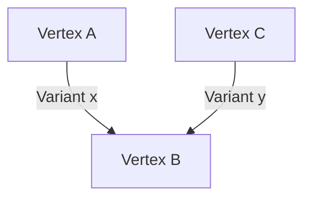
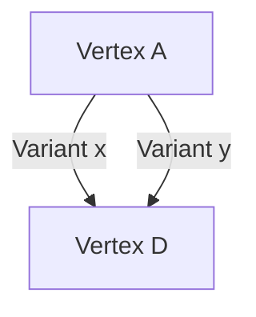

# Conditionals and Branching

Branching in the Nexus workflow DAG is powered by **output variants**. Each `Vertex` (Tool) evaluates to **exactly one output variant** at runtime, and these variants are **mutually exclusive**. This exclusivity ensures that branching can be modeled without introducing race conditions.


Think of branching in the DAG as a `switch` or `match` expression in a programming language:
a tool executes, evaluates into one variant, and only the branch connected to that variant is taken.


---

## How conditionals work

1. A `Vertex` is executed once its input ports are satisfied.
1. Execution of the tool produces **exactly one output variant**.
1. Each variant can have multiple outgoing edges, leading to new vertices.
1. Because variants are mutually exclusive, only **one branch path** is ever taken from a given vertex at runtime.

This makes conditionals in the workflow DAG explicit and safe: they cannot "split" into multiple variants simultaneously.

---

## Branching vs. Concurrency

- **Branching**: Multiple **output variants** define mutually exclusive branches. Only one is taken at runtime.
- **Concurrency**: A single output variant may connect to multiple edges. In that case, the walk **forks** into multiple concurrent executions.


Conditional branching (via output variants) and parallelism (via multiple outgoing edges from the same variant) can coexist in the same DAG. This enables both **decision-making** and **fan-out** within workflows.


---

## Valid and invalid patterns

### ✅ Concurrent branching

Once vertex `A` completes, its output variant spawns **two concurrent walks** → `B` and `C` execute in parallel.

---

### ✅ Conditional branching

Variants are **mutually exclusive**, so only **one branch** (`ok` or `err`) can be taken.
No race conditions are possible.

---

### ❌ Invalid race condition

Here, two different vertices send edges into the same input port of `B`.
This creates **two sources of data** → a **race condition**, which is **not allowed**.

---

### ✅ Variant-based conditional merge

Both edges lead to the same downstream input port of `D`.
Because only **one variant** of `A` is active at runtime, no race condition occurs.

---

## Design principles

- **Determinism**: Tools always evaluate into exactly one variant, ensuring only one conditional branch is taken.
- **Safety**: Static analysis validates that multiple concurrent walks cannot introduce race conditions.
- **Expressiveness**: Workflows can model decision trees, parallel execution, and conditional merges, all within the DAG semantics.
