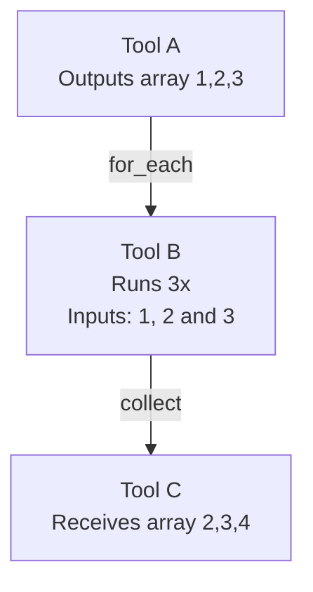
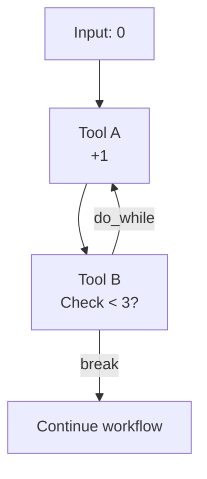

# Looping

The Nexus workflow DAG supports **looping constructs** via special **edge types**. These edges extend the basic semantics of the DAG to enable iteration, repetition, and array transformations while preserving the guarantees of determinism and safety.

Loops in the DAG are _not implicit cycles_ (which are otherwise forbidden). Instead, they are expressed explicitly through these loop edge types:

- `for_each`
- `collect`
- `do_while`
- `break`


Caveat: Loops **cannot nest**. Static analysis enforces this to avoid unbounded recursion or overly complex execution semantics.



Caveat: Intermediate vertices between `for_each` and `collect` **must not evaluate to array types**. This is because `NexusData` is represented as a two-dimensional vector (`vector[][]`), and nested arrays would require recursive serialization which is not currently supported. Moreover, this **cannot be enforced statically** as the return types of intermediate vertices may not be known until runtime.


---

## For-each and Collect

The **`for_each`** / **`collect`** pair enables iteration over arrays.

### For-each

- A `for_each` edge must originate from a vertex whose output port evaluates to an **array type**.
- The downstream vertex is evaluated **N times** (once for each element of the array).
- Each iteration executes **in parallel**, with no guarantee of order.
- Each iteration receives a single array element as its input data.

### Collect

- A `collect` edge must follow a `for_each` branch. There can, however, be any number of vertices between the `for_each` and `collect` edges.
- It **recombines** the results of the looped vertex into a new array.
- The order of elements in the resulting array is preserved, even though the loop body executes in parallel.


Think of `for_each` as a **map** operation, and `collect` as the **reduce back to array**.


---

### Example: Array transformation

Suppose Tool `A` outputs an array `[1, 2, 3]`.

1. A `for_each` edge connects `A` → `B`.

   - Tool `B` runs three times with inputs `1`, `2`, and `3`.
   - Each run produces an incremented number, outputting `2`, `3`, and `4`.

1. A `collect` edge connects `B` → `C`.

   - Tool `C` receives `[2, 3, 4]`.

This creates a parallel map-like computation:


It is perfectly valid to add another vertex (or any number of them) between `B` and `C` that also processes each element before collecting.


---

## Do-while and Break

The **`do_while`** / **`break`** edge pair enables conditional loops.

### Rules

- Both `do_while` and `break` edges must originate from **two distinct output variants** of the **same vertex**.
- Both edges **must** be present for the loop to be valid.
- On each iteration:

  1. The vertex produces an output.
  1. If the **`do_while` edge** is taken, execution loops back, overwriting the input data with the new outputs.
  1. If the **`break` edge** is taken, execution exits the loop and continues forward.

### Example: Increment until threshold

1. Tool `A` adds `+1` to a number.
1. Tool `B` checks whether the number is `< 3`.

   - If **true**, the `do_while` edge loops back to `A`.
   - If **false**, the `break` edge continues the walk.

At runtime:

- Start with `0`.
- Loop iterations: `1 → 2 → 3`.
- Once `3` is reached, the loop exits via `break`.

---

## Loop Execution Limits

- Loops are **bounded** with an iteration cap of `0xff` (255 iterations).
- This applies to both `for_each` iterations and `do_while` loops.
- If the limit is reached, the walk halts as failed.

---

## Design principles

- **Explicitness**: Loops are modeled with special edge types, never with raw cycles in the DAG.
- **Parallelism**: For-each executions run in parallel, but results are deterministically ordered at collect time.
- **Safety**: No nested loops are allowed. Iteration count is capped. Static validation enforces correct loop structure.

---

## Data Representation

To support loop semantics, `NexusData` is serialized as a **two-dimensional vector** (`vector[][]`).

- Outer vector: represents array elements or iterations.
- Inner vector: holds the serialized JSON data for each element.

For example:

- A tool `social.twitter.get-tweets` outputs `Tweet[]`.
- Each tweet is serialized into its own inner `vector[]`.
- This ensures `for_each` iteration and `collect` recombination work seamlessly at runtime.
