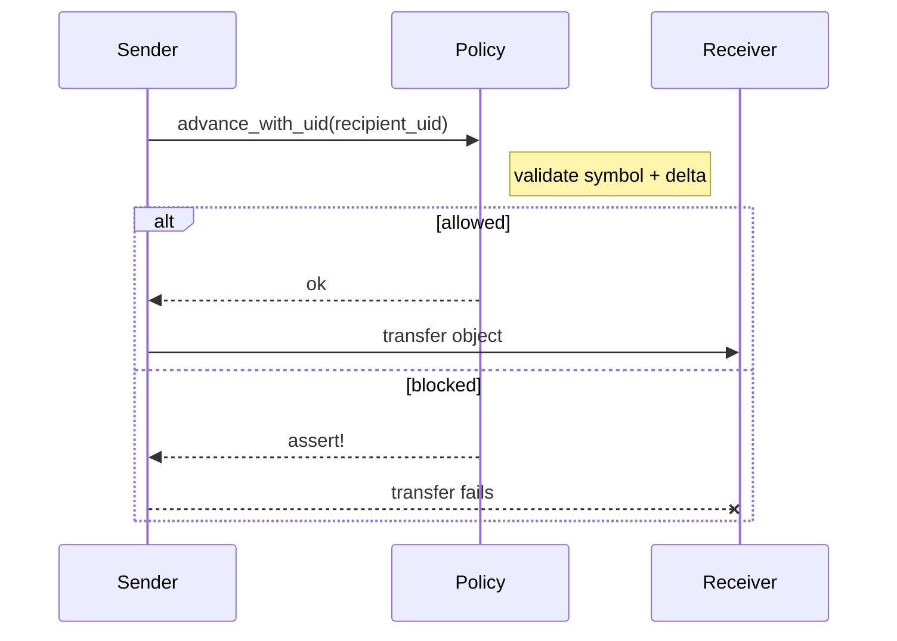

# Policy Module

## Overview
The policy module provides a reusable, on-chain deterministic finite automaton (DFA) that filters workflows. It defines the exact sequences of typed symbols that are allowed, advances state only on valid inputs, and asserts on anything off-path. The alphabet is typed (`Symbol = Witness(TypeName) | Uid(object::ID)`), so the policy acts as a dynamic dispatcher across any witness type or on-chain object in Sui.

## Why a DFA (Regex On-Chain)
- We need a regex over *typed* events: who acted (witness type) and which on-chain object was touched. DFA is the canonical, programmable form of that regex.
- Move has no runtime regex engine; a DFA gives deterministic, constant-cost membership checks and makes the accepted language explicit.
- Determinism is critical: given the current state and a symbol, there is exactly one next state and no ambiguity for untrusted executors to exploit.
- Keeping the automaton on-chain means the “prompt” lives with the asset/process—it cannot drift or be reinterpreted off-chain.

## What It Solves
- Represents allowed paths through state space (a DFA/regex over symbols) instead of ad-hoc checks.
- Enforces ordered workflows and routing (actors/objects in sequence) by construction.
- Allows constrained delegation: untrusted executors can drive the policy but cannot take off-path actions.
- Expresses intent precisely: a machine-readable “prompt” that executors must follow exactly.

## Formal Model
A policy is a DFA \(P = (\Sigma, Q, \delta, q_0, F)\):
- Alphabet \(\Sigma\): `Symbol = Witness(TypeName) | Uid(ID)` (any witness type or any object UID).
- States \(Q\), start state \(q_0\), accepting states \(F \subseteq Q\).
- Transition function \(\delta: Q \times \Sigma \to Q\).
- Accepted language \(L(P) \subseteq \Sigma^\*\) is the set of allowed traces. Because \(\Sigma\) spans all witnesses and UIDs, \(L(P)\) can describe paths anywhere in Sui state space.

## Core Types
- `Symbol`: `Witness(TypeName)` or `Uid(object::ID)`.
- `Policy<T: store>`: on-chain object holding UID, configured DFA, current state index, and caller payload/config data.

## How It Works
- See the companion [DFA module](./dfa.md) for the underlying automaton.
- **Alphabet + states:** The DFA basis is `u64` states; the alphabet is the set of witness type names and UIDs you register. Anything outside the alphabet asserts.
- **Transition table:** Stored as a dense `|States| x |Alphabet|` matrix. Given `(state_index, symbol_index)`, the policy jumps to the precomputed next index.
- **Config hooks:** Each `(state?, symbol)` pair can carry configs via dynamic fields. Lookups prefer specific `(state, symbol)` and fall back to `(*, symbol)`; missing configs assert when borrowed.
- **Linear helper:** `new_linear(sequence: TableVec<Symbol>, data, ctx)` builds a prefix-enforcing DFA: only the expected symbol at each step advances; other in-alphabet symbols self-loop. To hard-fail off-path inputs, exclude them from the alphabet or point them at a non-accepting sink.
- **Advancement:** `advance_with_witness` / `advance_with_uid` resolve the symbol, assert if absent, then update `state_index` using the transition matrix.
- **Acceptance:** `is_accepting` reads the current state bitmap; use it to gate payouts/side effects.
- **Reset:** `reset` returns to the start state, keeping configs and payload intact.

## Key Operations
- Build: `new(dfa, data, ctx)`; `new_linear(sequence: TableVec<Symbol>, data, ctx)` for step-by-step flows.
- Configure DFA: `add_symbol`, `add_state(..., ctx)`, `set_transition`, `set_accepting`.
- Register metadata: `register`, `register_uid`, `register_for_state`, `register_uid_for_state` (per symbol or per (state, symbol)).
- Advance: `advance_with_witness`, `advance_with_uid` (asserts on symbols outside the alphabet).
- Inspect: `state`, `state_index`, `is_accepting`, `dfa`, `configured_dfa`, `data`, `data_mut`.
- Borrow configs: `borrow_config*`, `borrow_state_config*` (immutable/mutable, witness/UID).
- Reset: `reset` to start state.

## Usage Patterns
- Approval pipelines: draft → review → approve → execute.
- Capability gating: only certain actors (witness types) or object UIDs can proceed, in order.
- Object routing: specific UIDs must be visited in sequence (checkpoints).
- Multi-step attestations: typed witnesses as symbols, each advancing the policy.
- Scheduling under constraints: prerequisites and required actions as symbols; scheduler advances only when constraints are met.

## Example: Gated Transfer (“Hot Potato”)
- Alphabet: `Uid(A)`, `Uid(B)`, `Uid(C)` (or witness types bound to those actors).
- DFA: linear sequence with accepting end via `new_linear`.
- Enforcement: call `advance_with_uid(policy, recipient_uid)` before transfer; off-path attempts assert and block.
- Metadata: per-hop configs (deadlines, fees) can be stored and checked alongside advancement.

## Sequence (Hot Potato)

## Integration Checklist
- Define alphabet (witness types or UIDs) and automaton (states, transitions, accepting states).
- Mint policy (`new`/`new_linear`), optionally register configs.
- At each critical step, call `advance_with_witness` or `advance_with_uid` before side effects.
- Gate completion/payout with `is_accepting`; enforce per-step constraints via registered configs.

## Mental Model
The policy is a DFA/regex over typed symbols spanning the whole Sui state space. Each interaction proposes a symbol; the policy either advances or asserts. Attaching it to assets/processes makes it a dynamic dispatcher and filter: only traces in the accepted language can occur, even when driven by untrusted executors.
