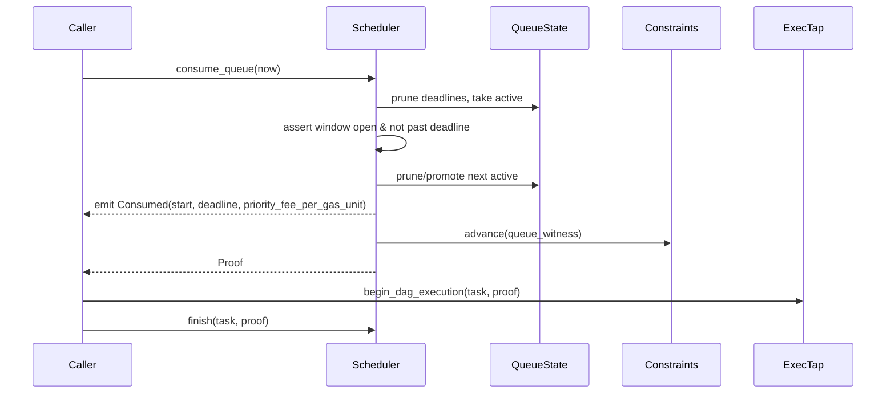
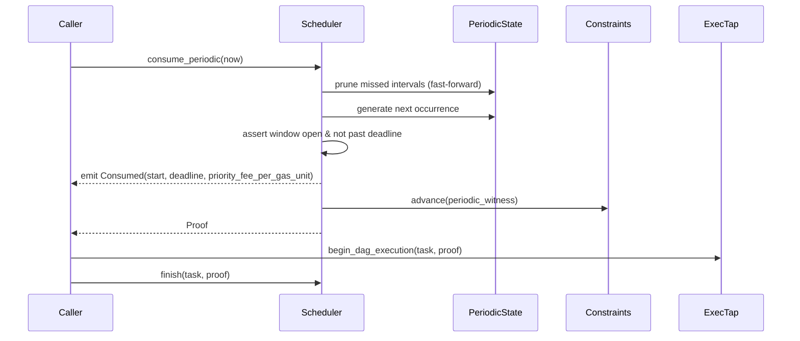

# On-chain Scheduler Architecture

> Time-based orchestration that gates workflow execution with deterministic ordering, observability, and policy enforcement. This document describes the architecture, not the code; names are conceptual and map to the Move package in `sui/workflow`.

---

## Purpose
- Decide **when** a workflow task may run (absolute queue + periodic cadences) using pluggable constraint modules.
- Enforce **ordering**: earliest start, then `priority_fee_per_gas_unit`, then FIFO.
- Provide **observability**: scheduled, consumed, missed, and configuration events.
- Hand off to execution only when **policy constraints** are satisfied, using proofs.
- Allow teams to plug new constraint or execution modules without changing the scheduler core.

---

## Domain Model
- **Task**: owned object that bundles metadata, a **constraints policy** (when it may run), an **execution policy** (what to do), and lifecycle state (Active, Paused, Canceled). The task is the authority boundary; policies are pluggable.
- **Constraints policy plane**: dispatch table of constraint modules. Time is the default module, but any predicate can be encoded by registering a module with its witness.
- **Execution policy plane**: dispatch table of execution modules. Default is “begin DAG execution”; any on-chain action can be registered behind its own witness.
- **Occurrence**: a generic “constraint window open” signal. Default shape is a time window (`start`, optional `deadline`) plus a `priority_fee_per_gas_unit` and a generator tag (Queue or Periodic), but occurrences conceptually carry “a scheduled opportunity”.
- **Queue generator**:
  - Single **active slot** advertised to observers.
  - **Pending heap** ordered by start time → `priority_fee_per_gas_unit` → FIFO.
  - **Sequence counter** to preserve FIFO on ties.
- **Periodic generator**:
  - Cursor with `next_start`, `period`, optional `deadline_offset`, optional `max_iterations`, `generated` counter, `last_emitted_start`, and `priority_fee_per_gas_unit`.
- **Generators**:
  - Produce occurrences (constraint signals) from user input or module config.
  - Own state/order (queue heap + active slot; periodic cursor; future cron/backoff/dependency logic).
  - Surface one active occurrence at a time; others stay buffered until consumed/pruned.
- **Policies**:
  - **Constraints policy** advances when an occurrence is consumed (via the module’s witness).
  - **Execution policy** advances when DAG execution begins (via its witness).
  - Both must be **accepting** to finish a task run; `finish` resets them.
- **Proof**: a non-droppable token returned when consuming an occurrence; must be provided to `finish` to close the run.

---

## Generator role
- Translate user intent or module config into occurrences (“this task is eligible starting at X with optional deadline Y and priority Z”).
- Maintain scheduling state and ordering for their strategy (queue heap + active slot; periodic cursor; custom cron/backoff/dependency logic).
- Emit exactly one active occurrence at a time to keep off-chain consumption simple; additional candidates stay buffered.
- Emit `RequestScheduledExecution` when an occurrence becomes active so off-chain knows to call the matching `check_*_occurrence`.
- Are pluggable: anyone can author and register a generator module/witness on the constraints policy to introduce new scheduling semantics.

---

## Event Surface
- `Scheduled` (queue or periodic occurrence advertised) wrapped in `RequestScheduledExecution<OccurrenceScheduledEvent>` carrying `priority` (ordering scalar; for this scheduler it equals `priority_fee_per_gas_unit`), creation time, start window, optional deadline, and generator symbol.
- `Consumed` (occurrence handed to execution).
- `Missed` (deadline pruned).
- `PeriodicConfigured` (configure/disable).
- Task lifecycle: Created, Paused, Resumed, Canceled.

Events are the contract for off-chain workers and observability; every state transition emits a structured event.

---

## Priority & Pricing
- `RequestScheduledExecution.priority` is a generic ordering primitive for off-chain executors: higher number means “higher priority” (run sooner). The executor is free to choose its own algorithm; only the ordering meaning matters.
- To prevent “always set max priority”, executors may attach a **cost** to priority. The generic model is: `priority_fee = effort * priority`.
- In Nexus leader, most work is an on-chain transaction, so `effort` is proxied by the tx’s on-chain work (compute + memory/storage) as reflected by Sui’s dry-run `GasSummary`.
- To convert “gas paid” into a work-like unit, normalize by the network’s reference gas price: `effort_units ≈ effective_gas_used / reference_gas_price`. Then `priority_fee ≈ effort_units * priority`.
- For this scheduler, we name the occurrence’s priority coefficient `priority_fee_per_gas_unit` because the leader’s priority cost is proportional to on-chain effort units; it ends up with “gas-price-like” units (fee per gas unit) without being the network gas price itself. Today the fee is paid in MIST on Sui, but the concept is denomination-agnostic.

---

## Off-chain leader loop
- Subscribe to `RequestScheduledExecution` (Scheduled) events; use the generator symbol to pick the correct `check_*_occurrence` entry (queue or periodic today).
- Call `check_*_occurrence` to obtain the proof; honor ordering and deadline assertions enforced on-chain.
- Start the registered execution module (default DAG tap) and pass gas amounts (execution + priority) as needed.
- Call `finish(proof)` to reset both policies; missing this leaves the task non-accepting.
- Monitor `Missed` and periodic configuration events for SLO/alerting.

---

## Queue Flow (One-off Occurrences)
1) **Enqueue**: build an occurrence (start + optional deadline offset + `priority_fee_per_gas_unit`), wrap with `request_time` + `sequence`, and offer to the queue.
2) **Active slot**:
   - If empty, activate and emit `Scheduled`.
   - If occupied, **preempt** only if earlier start; tie-breaker `priority_fee_per_gas_unit`, then FIFO.
3) **Prune**: drop active entries whose deadline is passed; emit `Missed`; promote the best pending candidate.
4) **Consume**:
   - Assert task is Active; generator present; `now >= start`; `now <= deadline` if set.
   - Emit `Consumed`; advance **constraints** with queue witness; return **proof**.
   - Active slot is refreshed (prune/promote) within the same call so observers see the next `Scheduled` immediately.
5) **Execute**: caller invokes default execution tap with the proof (see execution bridge).
6) **Finish**: caller provides proof to finalize; both policies must be accepting; reset.

Pseudo ordering rule:
```
priority = (earlier start)
if tie: higher priority_fee_per_gas_unit
if tie: lower sequence (FIFO)
```

Mermaid (queue consume path):


---

## Periodic Flow
1) **Configure**: set `first_start`, `period`, optional `deadline_offset`, optional `max_iterations`, `priority_fee_per_gas_unit`; emit `PeriodicConfigured`.
2) **Prune (fast-forward)**:
   - If `deadline_offset` is set and `now` passed it, compute how many intervals to skip (bounded by `max_iterations`).
   - Emit **one** `Missed` for the last skipped interval; advance cursor by `skipped`.
3) **Generate & Consume**:
   - Emit `Scheduled` for the next start; advance cursor by one.
   - Assert `now >= start` and `now <= deadline` if set.
   - Emit `Consumed`; advance **constraints** with periodic witness; return proof.
4) **Execute & Finish**: same as queue via execution tap and `finish`.

Mermaid (periodic consume path):


---

## Execution Bridge (Default Tap + DAG)
- **Config registration**: execution policy stores a DAG execution config keyed by `BeginDagExecutionWitness`.
- **Invocation**: `begin_dag_execution_from_scheduler` reads the stored config, starts DAG execution, syncs gas, optionally claims leader gas, requests network to execute walks, advances **execution policy** with `BeginDagExecutionWitness`.
- **Finish contract**: Scheduler `finish` asserts both policies are accepting and consumes the proof; resets both policies for the next run.

---

## Lifecycle & State
- **Active**: scheduling allowed.
- **Paused**: scheduling asserts; no new occurrences consumed.
- **Canceled**: scheduling asserts; queue is cleared; periodic disabled; lifecycle event emitted.
- **Ownership**: all user-facing mutators assert caller owns the task.
- **Reset**: only `finish` resets policies; forgetting to call `finish` leaves the task non-accepting.

---

## Safety and Ordering Guarantees
- Deadlines cannot precede starts; consumption asserts window and deadline.
- Single active queue slot removes ambiguity; preemption rules deterministic.
- Periodic fast-forward emits bounded missed events to avoid unbounded catch-up.
- Proof ties consumption to the task ID; misbound proofs assert.
- Policies enforce sequencing: constraints advance on consumption; execution advances on DAG start; both must accept to finish.

---

## Extensibility Notes
- **Constraint/Execution modules**: register new modules (with witnesses) to add arbitrary predicates or on-chain actions without changing scheduler core.
- **Multiple generators**: current design enforces exactly one; adding coexistence would require multiplexed generator configs and event symbols.
- **Throughput**: to increase parallelism, consider multiple active queue slots or batch scheduling; would need event and consumer changes.
- **Observability**: periodic pruning currently emits one missed event per fast-forward; configurable per-interval emission could be added.
- **Ergonomics**: auto-reset on proof drop could prevent stuck tasks if `finish` is omitted.

---

## At-a-Glance Checklist (Integrators)
- Register **one** generator: Queue **or** Periodic.
- Register execution config via default tap with `BeginDagExecutionWitness`.
- Enqueue occurrences (queue) or configure schedule (periodic).
- Consume via `check_queue_occurrence` or `check_periodic_occurrence`; capture proof.
- Invoke execution tap; then call `finish(proof)`.
- Listen to events: Scheduled, Consumed, Missed, PeriodicConfigured, lifecycle.
