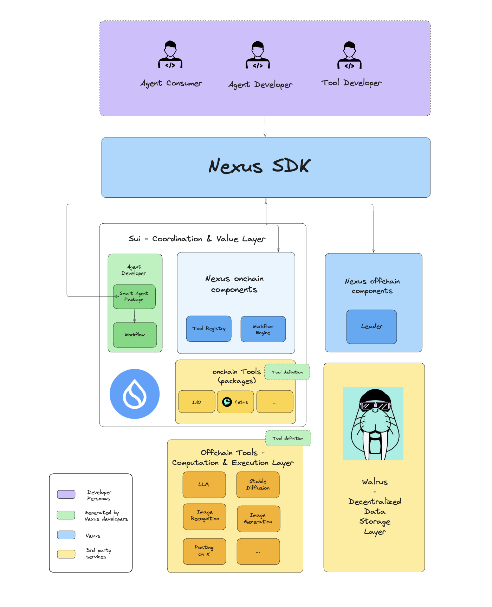

# 👋 Introducing Nexus

The **Talus platform, powered by Nexus**, allows for an open ecosystem consisting of many actors, our community, building towards a future with Talus AI agents that revolutionize digital experiences to serve everyone.

In the previous section we defined Talus agents as leveraging multiple layers:

* Blockchain as the coordination and value layer.
* Decentralized data storage platform as the data layer
* Offchain (AI) infrastructure as the computation/execution layer


At first sight, this layered approach introduces more coordination complexity. This, in a way, is the case. This is exactly why we offer Nexus, the developer framework for building Talus agents. Nexus acts as a tool to streamline the developer experience.


<figure><figcaption></figcaption></figure>

In essence, Nexus as a framework enables us to bridge the gap between the different layers that make up a Talus agent workflow, between the onchain and offchain world. It does the heavy lifting in the background and provides the developer with and easy to interact with SDK.

To get a holistic overview of all actors and technical components of the Talus platform, let’s consider the following diagram.

### Technical Component Overview

Developers building with Nexus (purple) will primarily interact through the Nexus SDK, so the complexity is abstracted away from them.

The current version of Nexus is a combination of onchain and offchain components, corresponding with the different layers. Let’s give an overview:

#### Sui - the Coordination & Value Layer

The onchain components are initially deployed on the Sui Blockchain, and thus the smart contracts written in Sui Move. The reasoning behind picking Sui as the first layer to deploy Nexus, are examined in [another section](../talus-overview/why-sui-move.md).

There’s 3 different types of onchain Sui packages that are relevant for Nexus and Talus agents:

1. **Talus Agent Package (TAP**): A developer building an agent will deploy a Talus Agent Package (TAP) to the blockchain. Its main purpose is to store the agent’s workflow and some additional custom business logic. (This is managed by the agent developer with tooling provided by Nexus SDK)
2. **Tools**: Tools in used by Talus agents can either be offchain or onchain. In the case of onchain tools, agent developers will have a wide array of options to use existing Sui packages and use them as onchain Tools.
3. **Onchain Components**: The Nexus onchain components are packages maintained by the Talus Labs team that enable the deployment and execution of agent workflows. It consists of some primitives, a package to manage the workflow and a registry for (onchain or offchain) Tools.

#### Walrus - the Data Storage Layer

Some crucial metadata associated with the agent workflow has to be stored onchain (Sui). However, due to the expensive nature of a coordination and value blockchain like Sui, all data that can be stored elsewhere ought to do so. Walrus, a decentralized data storage platform built by the Mysten Labs team, provides an excellent alternative. Technically also a decentralized ledger, from the viewpoint of the agent and onchain components of Nexus, data stored on Walrus can be considered “offchain”.

Data that could be stored on Walrus includes: agent metadata, agent memory and context for the agent’s operation.

#### Offchain Tools - the Computation & Execution Layer

Many of the AI tools an agent could be using (e.g. LLMs, image recognition or generation, text processing tools, mathematical operations, web access functions, file handling utilities etc.) would prove to be too expensive to perform fully onchain, i.e. have the computation performed by every validator through consensus.

Instead the Tool is executed offchain, with its inputs and outputs being provided by an offchain service, which we’ll discuss next.

#### Nexus Offchain

Provided that the agent workflow is deployed onchain, but the Tools (can be) run offchain, there is a need for Nexus to provide an offchain service that will orchestrate the communication between the onchain and offchain worlds. That component is the **`Leader`** component in the Nexus (offchain) backend.

The Leader will:

* Listen for events emitted by the agent’s onchain workflow that request execution of an offchain Tool
* Index these events
* Look up the Tool information in the onchain Tool registry
* Request the execution of the Tool and provide it with the inputs
* Listen for the Tool execution result (or error) and then communicate the outputs back to the workflow onchain

Through the actions of the Leader, we can resume an onchain workflow after the execution of an offchain Tool has successfully occurred.

Note: the term Leader has been chosen with a future of progressive decentralization in mind, when the Leader process will be part of a decentralized protocol.

### Ecosystem Actors

Next to an analysis of the technical components in the diagram, we can also consider the different actors that are interacting with all of the components. We’ll distinguish between:

* **Developer Personas**: Those individuals or entities that will be building with or contribute to Nexus and Talus as a whole.
* **Ecosystem Partners**: Those providers of services, infrastructure or onchain contracts that add value to the Talus ecosystem without requiring active engagement with the Nexus framework.


The developer personas are a proxy for the applications they represent or perform services for. Ultimately, Nexus as a framework, aims to empower applications to leverage onchain agents in a seamless manner.


#### Developer personas

For the purposes of this documentation we make distinction between different user roles within the ecosystem:

* **Nexus maintainer:** Core team member that maintains the Nexus codebase.
* **Tool developer:** Developer who integrates an existing Tool with Nexus by ensuring the Tool definition complies with the expected interface and the tool is registered.
* **Agent developer:** Developer who designs the agent workflow and subsequently deploys the agent smart contract.
* **Application Developer:** Developer who builds applications using agents.

#### Ecosystem Partners

For the purposes of this documentation we make the distinction between different partners:

* **Service Provider (for Tools)**: These are 3rd party entities that run services that are desirable for Tool developers to integrate as additional offchain features for AI agents.
* **Onchain applications (for Tools)**: These are onchain applications or contracts on the Sui blockchain that can be used for Tool developers to integrate as additional onchain features for AI agents.
