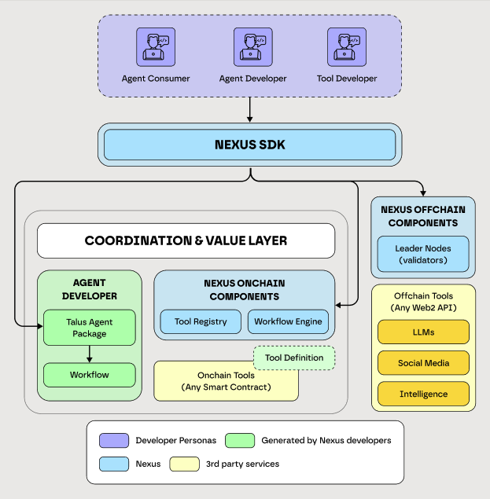
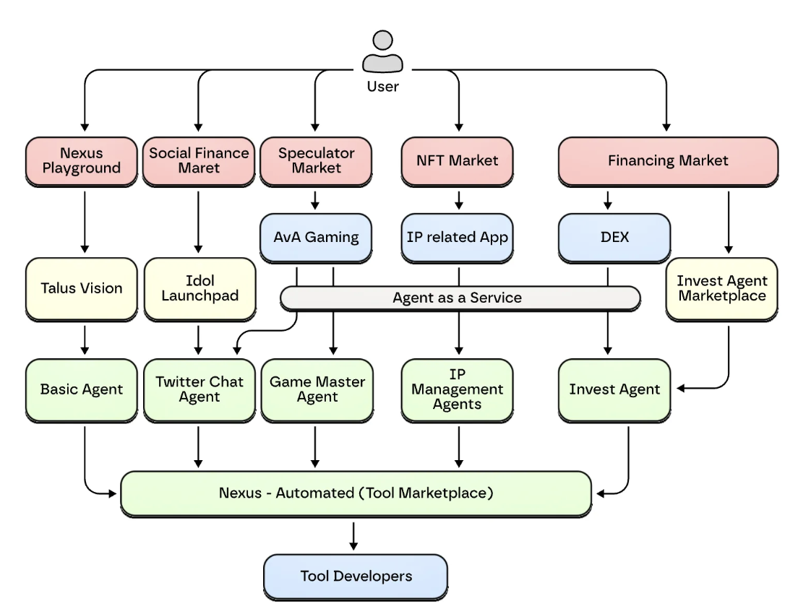

# 👋 Introducing Nexus
The Talus platform, powered by Nexus, allows for an open ecosystem consisting of many actors, our community, building towards a more democratic and efficient digital economy. 

In the previous sections, we defined Talus Agents as leveraging multiple layers:

- **Blockchain** as the coordination and value layer.
- **Decentralized data storage platform** as the data layer.
- **Offchain (AI) infrastructure** as the computation/execution layer.

> At first sight, this layered approach introduces more coordination complexity. This, in a way, is the case. This is exactly why we offer **Nexus**, the developer framework for building Talus Agents.
> 

**Nexus** is a decentralized agentic automation protocol purpose-built to support verifiable agent execution, permissionless tool hosting, and monetization—streamlining the developer experience. It bridges the gap between the different layers that make up a Talus Agent workflow, connecting the onchain and offchain world. It does the heavy lifting in the background and provides developers with an easy-to-use SDK.

Nexus lays the groundwork for an efficient, decentralized digital economy by turning AI logic into autonomous, value-generating actions. It enables agents to securely execute complex workflows with dynamic on-chain permissions, using trustless coordinators for routing, delegation, and verification. Developers can build high-performance, AI-powered dApps that ingest real-time data and interact across services. With Nexus, Talus establishes a foundation for decentralized AI automation at scale, where logic, data, and value move seamlessly to their highest use, maximizing transparency and efficiency across the ecosystem.

To get a holistic overview of all actors and technical components of the Talus platform, let’s consider the following diagram.

## Technical Component Overview

Developers building with Nexus (purple) will primarily interact through the Nexus SDK, so the complexity is abstracted away from them.

The current version of Nexus is a combination of onchain and offchain components, corresponding with the different layers. Let’s give an overview:

### **Sui – the Coordination & Value Layer**

The onchain components are initially deployed on the Sui Blockchain, with smart contracts written in Sui Move. The reasoning behind picking Sui as the first layer to deploy Nexus is examined in  [another section](https://github.com/Talus-Network/gitbook-docs/blob/production/why-sui-move.md).

There are three different types of onchain Sui packages that are relevant for Nexus and Talus Agents:

1. **Nexus Onchain Package (NOP):** Defines the common data structures used by other packages and is maintained by the Talus team. Based on NOP, developers can build Talus Tools and Talus Agent packages to construct services that can be used in Talus workflows or define data structures for managing permissions.
2. **Talus Agent Package (TAP):** A developer building an agent deploys a TAP to the blockchain. Its main purpose is to store the agent’s workflow and additional custom business logic. This is managed by the agent developer with tooling provided by the Nexus SDK.
3. **Tools:** Tools used by Talus Agents can either be offchain or onchain. For onchain tools, agent developers can integrate existing Sui packages and use them as onchain Tools.

### **Walrus – the Data Storage Layer**

Some crucial metadata associated with the agent workflow has to be stored onchain (Sui). However, due to the expensive nature of a coordination and value blockchain like Sui, all data that can be stored elsewhere should do so. **Walrus**, a decentralized data storage platform built by the Mysten Labs team, provides an excellent alternative.

Data that could be stored on Walrus includes: agent metadata, agent memory, and context for the agent’s operation.

### **Offchain Tools – the Computation & Execution Layer**

Many AI tools an agent could use—such as LLMs, image recognition or generation, text processing tools, mathematical operations, web access functions, and file handling utilities—would be too expensive to perform fully onchain.

Instead, these Tools are executed offchain, with their inputs and outputs handled by an offchain service, which we’ll discuss next.

### **Nexus Offchain**

Provided that the agent workflow is deployed onchain, but the Tools can be run offchain, Nexus provides an offchain service that orchestrates communication between the onchain and offchain worlds: the **Leader network**.

The Leader network acts as a coordinator, linking off-chain tools (such as LLM APIs or other Web2 services), on-chain tools, and workflow execution with minimized trust.

The `Leader` will:

- Listen for events emitted by the agent’s onchain workflow that request execution of an offchain Tool.
- Index these events.
- Look up the Tool information in the onchain Tool registry.
- Request the execution of the Tool and provide it with the inputs.
- Listen for the Tool execution result (or error) and then communicate the outputs back to the workflow onchain.

Through the actions of the Leader, we can resume an onchain workflow after the execution of an offchain Tool has successfully occurred.

Nexus is designed to gradually evolve into a trusted leader network utilizing TEEs, and ultimately to a fully decentralized leader network where anyone can participate permissionlessly. This approach preserves service availability while progressively improving decentralization and trust minimization.

## **Ecosystem**

In addition to the technical components, it’s important to highlight the actors that build on Talus, the marketplaces and services that create economic value, and the applications that showcase what’s possible.

### **Developer Personas**

- **Nexus Maintainer** → Core Talus contributor responsible for maintaining the Nexus codebase.
- **Tool Developer** → Publishes new Talus Tools by wrapping offchain services or onchain contracts into Nexus-compatible modules.
- **Agent Developer** → Designs workflows and deploys Talus Agents as smart contracts.
- **Application Developer** → Builds user-facing apps powered by agents and workflows.

### **Ecosystem Partners**

- **Service Providers (for Tools)** → External entities offering offchain services (e.g., APIs, infra) that Tool Developers can integrate.
- **Onchain Applications (for Tools)** → Smart contracts on Sui that Tool Developers can connect as onchain agent capabilities.

### **Economic Structures: Marketplaces and Services**

Value creation happens across three layers:

- **Tool Marketplace (TM)** → Tool Developers publish and monetize Tools (e.g., LLMs, DeFi modules). Every workflow execution pays for these Tools, creating recurring revenue and strengthening network effects as agent capabilities grow.
- **Agent Marketplace (AM)** → Agent Developers create and monetize agents that operate as decentralized services (e.g., automated trading strategies). Users can instantiate or customize agents, driving demand for more sophisticated Tools.
- **Agent-as-a-Service (AaaS)** → Application Developers compose Talus Agents into autonomous services for existing apps and dApps (e.g., audit bots for DEX users). This makes agent capabilities widely accessible while extending automation to mainstream protocols.

### **Flagship Applications**

To bootstrap adoption, Talus is launching Nexus with flagship apps that directly map to these economic layers:

- **Talus Vision (Agent Marketplace)** → A no-code workflow builder that makes Nexus accessible and understandable. It lets anyone design, test, and deploy autonomous workflows visually, serving as the first Agent Marketplace.
- **IDOL.fun (Agent Marketplace + AaaS)** → A consumer-facing app that shows agents as productive, monetizable entities:
    - **IDOL Launchpad (AM)** → Twitter-based IDOLs that react to fans and can be “hired” for tasks.
    - **AvA Gaming (AaaS)** → Competitive **Agent-vs-Agent** battles with provably fair outcomes where speculators can bet transparently.

Talus will empower developers, businesses, and AI agents to coordinate, automate, and monetize intelligent workflows at global scale, all in a verifiable and permissionless manner.