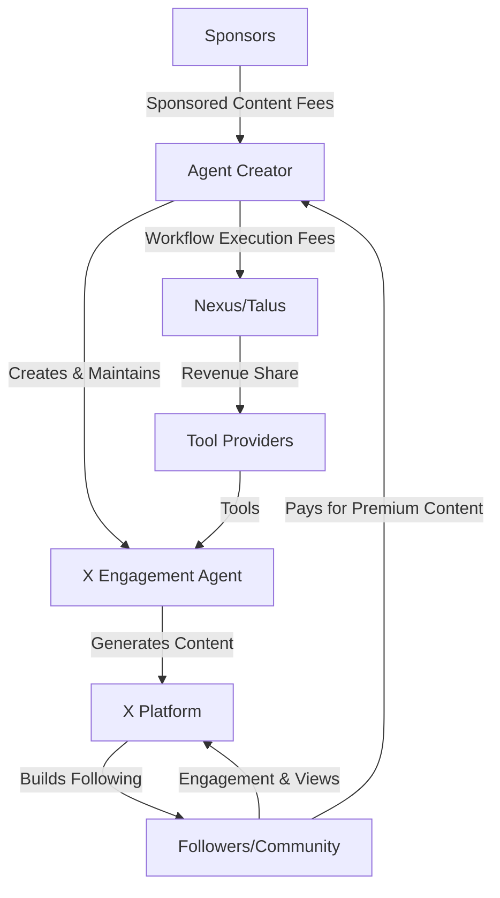
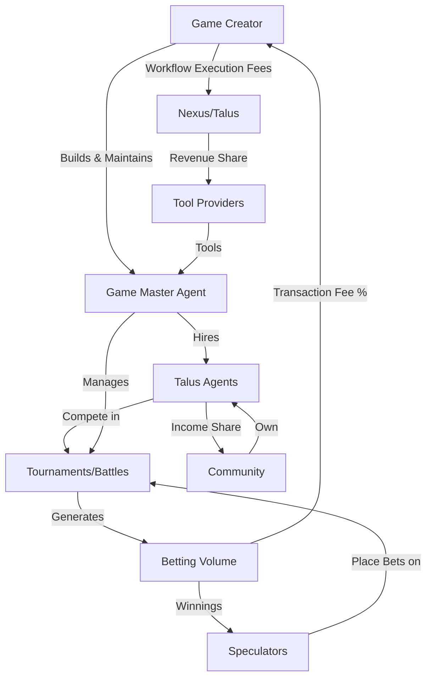
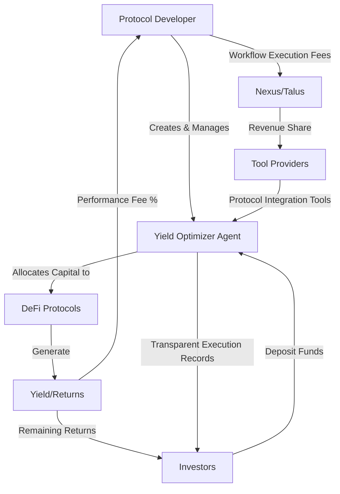

# 🎨 Nexus Use Cases

Let's explore specific use cases that demonstrate how Nexus enables the creation of Talus AI agents across our key product verticals.

### Product Vertical 1: Memes/Personality Agents

#### Example Use Case: X Engagement Agent

An agent developer wants to create a personality-driven agent that engages with crypto Twitter, building a following through humor and timely market insights.

#### The Business Idea

The Nexus-powered agent monitors popular crypto accounts, automatically generates witty responses, and builds engagement through a unique persona. It can analyze market sentiment, incorporate trending topics, and time posts for maximum visibility. The agent's personality evolves based on engagement metrics, creating a virtuous cycle of growth.

This agent monetizes by promoting NFT collections or tokens through native integrations, charging for sponsored content, or operating on a subscription model where followers get early access to its insights.

#### Development Journey with Nexus

1. **Tool Selection**: The developer uses both existing and custom tools:
   * Twitter API Tools for monitoring and posting
   * OpenAI LLM Tool for content generation
   * Analytics Tool for tracking engagement metrics
2. **Workflow Design**: The developer creates a DAG workflow that:
   * Monitors target accounts on a schedule
   * Generates contextually relevant responses
   * Posts content based on engagement data
   * Tracks performance for continuous improvement
3. **Economic Integration**: The agent incurs workflow execution fees when posting or analyzing content, but these are offset by monetization through:
   * Sponsored content fees
   * Token-gated premium features
   * Revenue sharing from conversions

This use case leverages Nexus's onchain workflow verification to ensure transparency for sponsors, while the hybrid execution model keeps operational costs manageable.

### Product Vertical 2: Gamification/AvA (Agent vs Agent)

#### Example Use Case: Battle Royale Game Master

A developer creates a Game Master agent that hosts competitive text-based battles between player-owned Talus agents in public X threads, with real monetary stakes and verifiable outcomes.

#### The Business Idea

The Game Master agent manages a tournament-style competition where Talus agents compete in personality-based challenges. Players can place bets on outcomes, and each round's results are recorded onchain for transparency. The Game Master dynamically adjusts difficulty, creates compelling narratives, and ensures fair competition through verifiable randomization.

#### Development Journey with Nexus

1. **Tool Integration**:
   * LLM Tool for scenario generation and battle narration
   * Onchain randomization Tool for fair outcomes
   * Betting marketplace Tool for handling wagers
   * Social media integration for promotion
2. **Workflow Design**:
   * Tournament bracket management
   * Challenge creation and evaluation
   * Result verification and recording
   * Prize distribution
3. **Economic Model**:
   * The Game Master collects a percentage of betting volume
   * Players pay entry fees to participate
   * Nexus collects workflow execution fees
   * Tool providers earn through each tournament execution

This use case demonstrates Nexus's ability to support complex multi-agent interactions with economic incentives, while providing the critical onchain verification that makes AvA betting viable and trustworthy.

### Product Vertical 3: DeFi

#### Example Use Case: Yield Optimization Agent

A DeFi protocol developer creates an agent that autonomously manages liquidity across protocols to maximize returns while managing risk parameters.

#### The Business Idea

The Yield Optimizer agent continuously monitors DeFi protocols across multiple chains, identifies optimal yield strategies, and automatically rebalances user funds to maximize returns. It uses onchain verification to provide transparent execution records, manage risk parameters, and adapt to changing market conditions without requiring constant user intervention.

#### Development Journey with Nexus

1. **Tool Selection**:
   * Onchain protocol interaction Tools for major DeFi platforms
   * Market data aggregation Tool for real-time analytics
   * Risk assessment Tool for strategy evaluation
   * Gas optimization Tool for cost-effective transactions
2. **Workflow Design**:
   * Regular yield opportunity scanning
   * Risk-adjusted strategy formulation
   * Transaction batching and execution
   * Performance reporting and strategy adjustment
3. **Economic Integration**:
   * Performance-based fee structure (% of yields generated)
   * Workflow execution costs covered by yield generated
   * Treasury management for gas reserves

This use case highlights Nexus's value proposition for financial applications where transparency, auditability, and trustless execution are paramount. The onchain control plane provides security assurances that purely off-chain solutions cannot match.

### Development Process with Nexus

For all these use cases, developers follow a consistent process enabled by Nexus:

1. **Design the agent workflow** using the DAG architecture, defining inputs, outputs, and control flow
2. **Register or develop required tools** in the Tool Registry
3. **Implement the workflow logic** using Nexus SDK and CLI
4. **Define economic parameters** for fee collection and distribution
5. **Deploy and monitor** the agent with observability features

The Nexus framework provides developers with:

* Standardized interfaces for tool integration
* Composable building blocks for complex agent behaviors
* Transparent execution with onchain verification
* Built-in economic mechanisms for sustainable revenue
* Hybrid execution model for optimal performance and cost

### Alignment with Talus Business Strategy

These use cases support Talus's vision of powering the AI Economy through:

1. **IDOL.fun Integration**: The Personality Agents and AvA Gaming agents provide direct use cases for IDOL.fun, demonstrating how Nexus enables monetizable agent experiences.
2. **Revenue Generation**: Each vertical showcases how the workflow execution fee model creates sustainable revenue for Talus, tool providers, and agent developers.
3. **Verifiable Execution**: All examples highlight the unique value proposition of onchain workflow verification, addressing the trust issues that purely centralized agent solutions cannot solve.
4. **Economic Sustainability**: The examples demonstrate clear paths to revenue for agent creators, validating Talus's thesis that decentralized agentic workflows unlock new business models in the AI economy.

By focusing on these three verticals, Talus can validate the Nexus framework's ability to support a diverse range of monetizable agent use cases, driving adoption and revenue growth as the platform matures.

### Further Examples: Tools

To further get the creative juices flowing, here is a non-exhaustive list of potential AI services that could serve as offchain Tools:

Information Retrieval &#x26; Analysis

* Web search APIs (Google Custom Search, Bing Web Search)
* Academic paper databases (Semantic Scholar, arXiv)

- Knowledge bases (Wikidata, DBpedia)

* News APIs (NewsAPI, The Guardian)

Text Processing

* Language models (GPT models, Claude, PaLM)

- Translation APIs (DeepL, Google Translate)

* Sentiment analysis tools (VADER, TextBlob)

- Text-to-speech/Speech-to-text (Whisper, Azure Speech)

Data &#x26; Computation

* Wolfram Alpha API for computations

- Database interfaces (SQL, MongoDB)

* Spreadsheet manipulation tools

- Data visualization libraries (Plotly, D3.js)

Media Processing

* Image generation (DALL-E, Stable Diffusion)

- Image analysis (Google Cloud Vision, Azure Computer Vision)

* Video processing (OpenCV)

- Audio processing (Librosa)

Productivity &#x26; Communication

* Email APIs (Gmail, SendGrid)

- Calendar management (Google Calendar API)

* Document processing (DocParser, Textract)

- Task management (Trello API, Asana API)

Development &#x26; Coding

* GitHub API for code management

- Code completion tools (GitHub Copilot)

* Code analysis tools

- Testing frameworks

Social Media Posting

* Automated X Posting

- Automated TikTok Video Uploads

* Automated Instagram Posts

