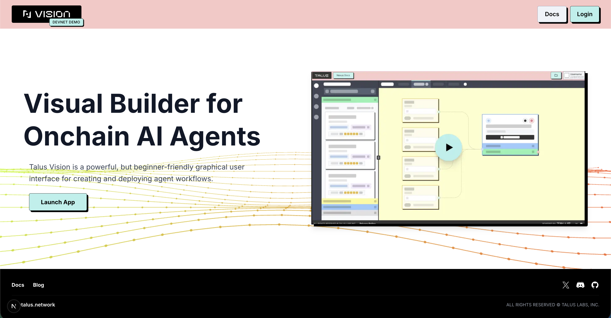

# Talus Vision

Talus Vision is a low-code platform developed by Talus Labs, designed to make it simple for anyone to build, edit, and deploy on-chain agent workflows. Its architecture provides an intuitive interface and seamless integration with Nexus, enabling developers and non-developers alike to create verifiable agentic automations.

By connecting a Sui wallet, users can build, test, and deploy custom workflows directly on-chain through a clean and powerful visual environment.

This devnet demo provides users with the following capabilities:

- Easy Sui wallet connection with support for multiple accounts  
- VS Code–style multi-tab editor for fast iteration and parallel workflow editing  
- Autosave and manual save options for persistent, reusable sessions  
- Ability to create, visualize, and edit custom workflows using a clear DAG interface  
- Rich tool documentation, including input/output schemas and detailed descriptions for every Nexus tool  
- JSON editor with real-time validations, ensuring correctness against Nexus execution rules  
- Access to previously deployed workflows, enabling iterative updates and versioning  
- Built-in encryption for handling on-chain data privacy and sensitive fields  
- One-click deployment, allowing users to deploy workflows directly on-chain with their Sui wallet  
- On-chain workflow execution, enabling live, verifiable transaction processing from deployed workflows  
- Ability to easily manage multiple entry groups (<https://docs.talus.network/getting-started/dev-guides/math-branching-dag-entry#understanding-entry-groups>), group related entry points, and define how each DAG execution begins  
- Clear visualization of workflow execution paths, helping users understand branching, conditions, and tool dependencies  
- Error-surfacing and validation logging, enabling users to debug workflows quickly before pushing on-chain
  
<figure><figcaption></figcaption></figure>
