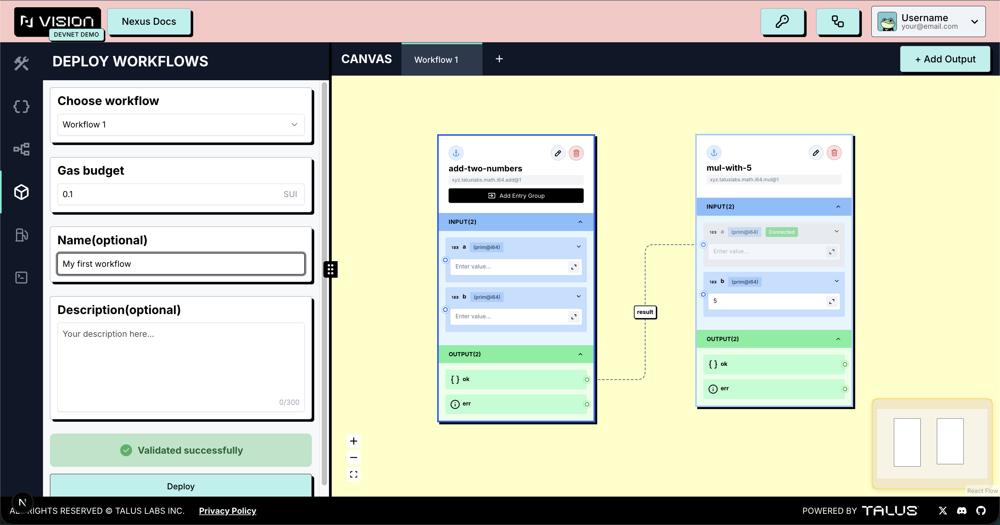

---
layout:
  width: default
  title:
    visible: true
  description:
    visible: false
  tableOfContents:
    visible: true
  outline:
    visible: true
  pagination:
    visible: true
  metadata:
    visible: true
---

# Deploy Workflows Tab

It provides a feature that allows users to **deploy workflows developed on the playground with a single click**. It works in conjunction with the **JSON Editor**, tracking the validation status of user-created workflows and enabling **on-chain deployment** using the **Sui wallet**.

During the demo, the platform operates with a **default gas budget of 0.1**. Users can increase the gas budget if desired.

If the deployment is successful, the playground automatically switches from **Edit Mode** to **View Mode**, and the user is provided with the **on-chain object ID**.

<figure><figcaption></figcaption></figure>
