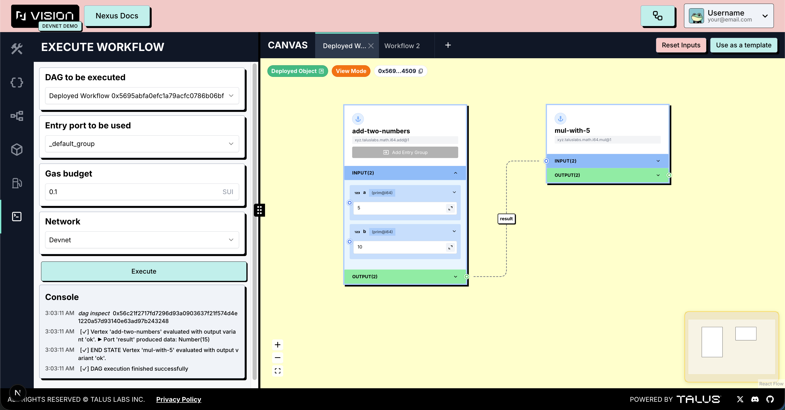

---
layout:
  width: default
  title:
    visible: true
  description:
    visible: false
  tableOfContents:
    visible: true
  outline:
    visible: true
  pagination:
    visible: true
  metadata:
    visible: true
---

# Execute Workflow Tab

This tab allows users to run any workflow they have already deployed. After providing the required inputs in the playground, the workflow can be executed directly from here.

- **On-chain execution:** All operations run on-chain, ensuring transparent and verifiable results.
- **Execution output:** The console displays the full transaction output, making it easy to inspect execution details.
- **Entry group support:** If a workflow contains multiple entry groups, the tab validates inputs after the user selects which group to run, ensuring a smooth and error-free execution experience.

<figure><figcaption></figcaption></figure>
