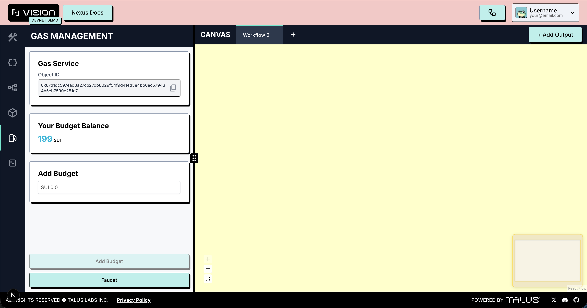

---
layout:
  width: default
  title:
    visible: true
  description:
    visible: false
  tableOfContents:
    visible: true
  outline:
    visible: true
  pagination:
    visible: true
  metadata:
    visible: true
---

# Gas Management Tab

The **Gas Management tab** allows users to **create a budget** for their **Nexus operations**.

- Users can **add SUI balance** from their **Sui wallets** to their gas budgets.
- Users can **view their gas budget** in real-time.
- In the **demo version**, it provides **Sui faucet support** on the **Talus Devnet**.

<figure><figcaption></figcaption></figure>
