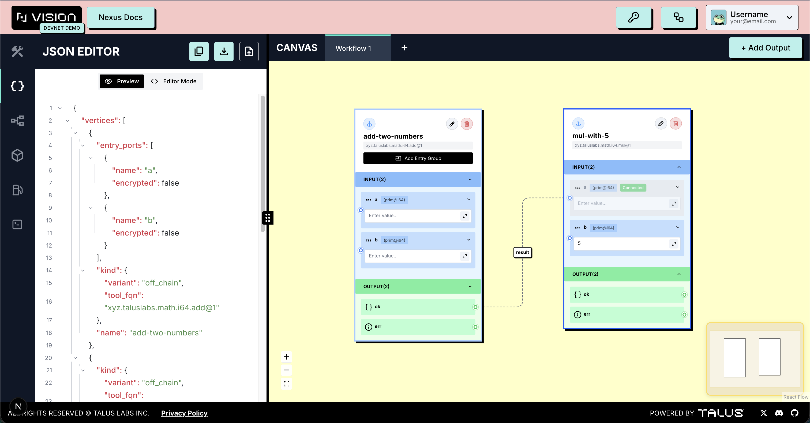
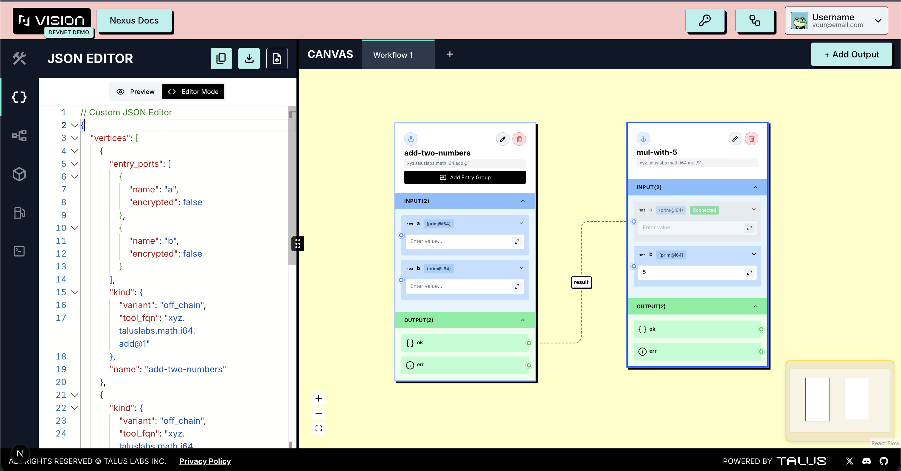

---
layout:
  width: default
  title:
    visible: true
  description:
    visible: false
  tableOfContents:
    visible: true
  outline:
    visible: true
  pagination:
    visible: true
  metadata:
    visible: true
---

# Json Editor Tab

The **JSON Editor tab** provides **real-time Nexus validation** while users build their workflows, offering guidance as needed. It features both **Preview Mode** and **Editor Mode**, optimizing the user experience during workflow creation.

The **JSON Editor tab** offers the following features:

* **Preview Mode:** Provides real-time workflow validation
* **Editor Mode:** Supports a **VS Code–style editor**
* **Easy Copying:** Quickly copy JSON content
* **Export JSON:** Download workflows as a **JSON file**
* **Import JSON:** Load previously created **JSON files** into **Talus Vision** for use

<figure><figcaption></figcaption></figure>

<figure><figcaption></figcaption></figure>
