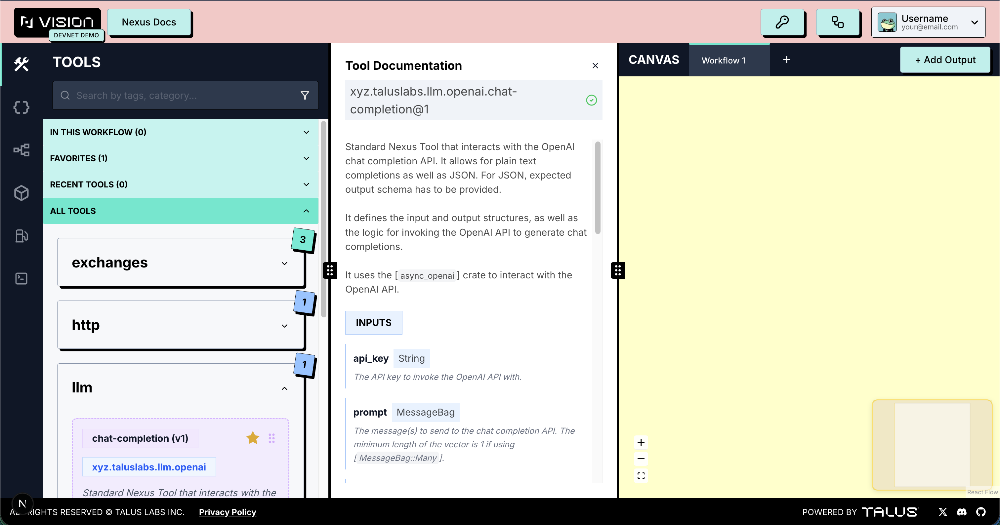

---
layout:
  width: default
  title:
    visible: true
  description:
    visible: false
  tableOfContents:
    visible: true
  outline:
    visible: true
  pagination:
    visible: true
  metadata:
    visible: true
---

# Tools Tab

The Tools tab lists all previously developed Nexus tools, providing users with easy access. All available tools can also be found in the [nexus-sdk repository](https://github.com/Talus-Network/nexus-sdk/tree/main/tools).

- All tools are categorized based on their functionality.
- The Tools tab displays all available tools in one place, including a special section for quick access to your favorite and most frequently used tools.
- Tools listed under each category can be easily added to the playground using the drag-and-drop feature. Each tool includes a description, along with detailed input and output properties. Users can review these details thoroughly and access the tools they wish to use with ease. Tools that are **registered** are clearly marked, and their usage is recommended.

    <figure><figcaption></figcaption></figure>
