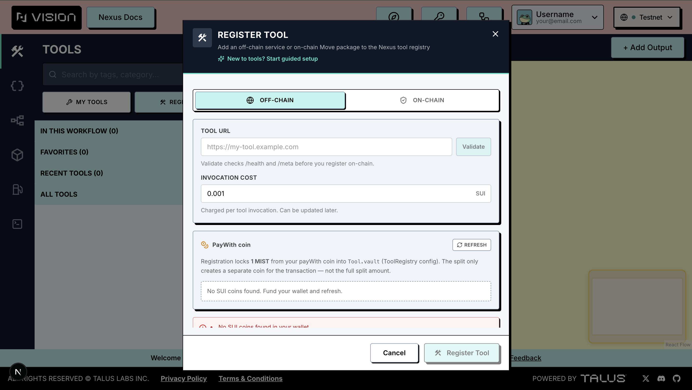
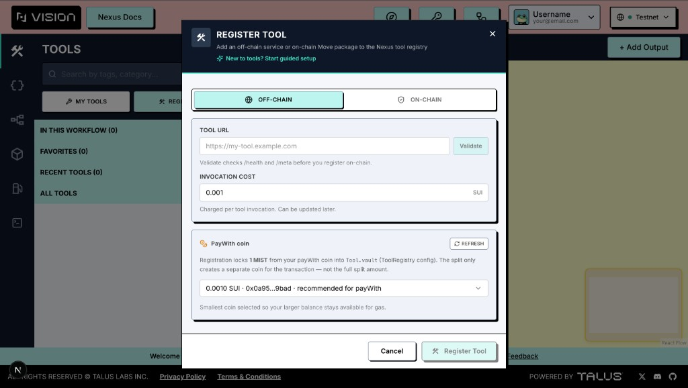
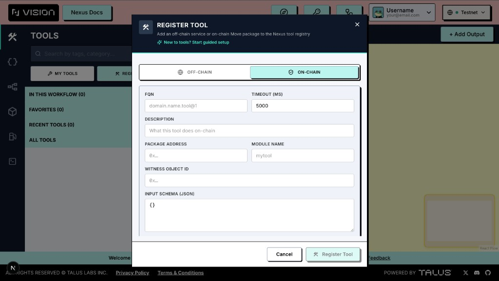
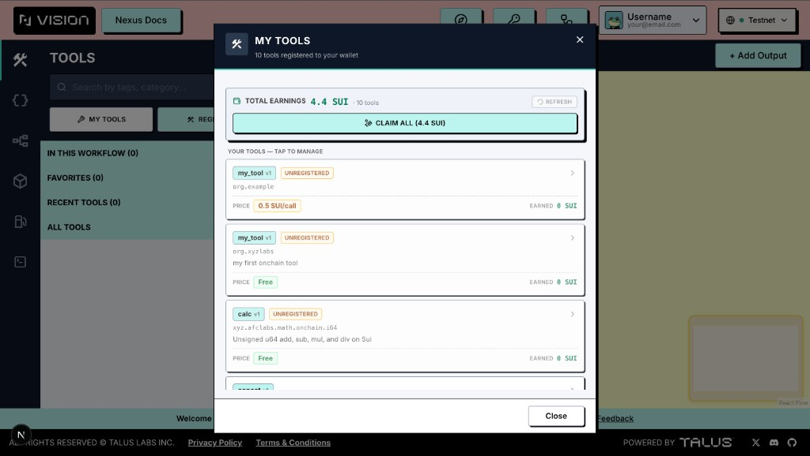
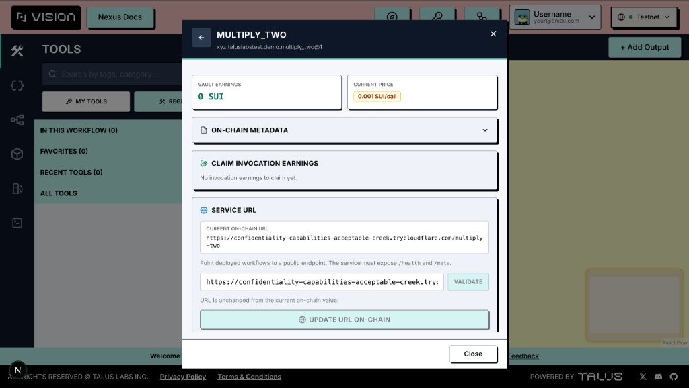
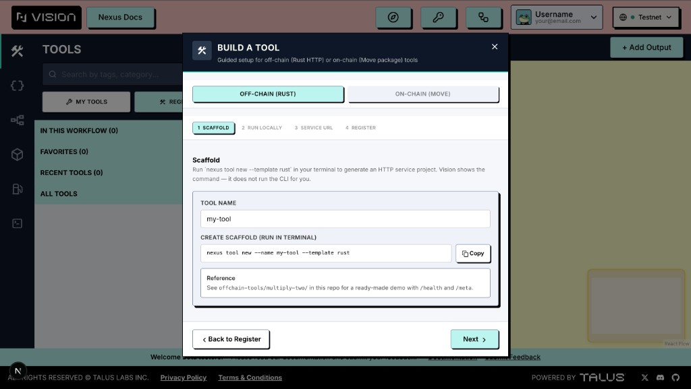
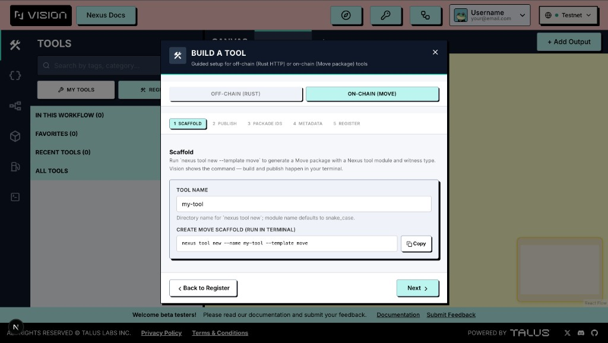

---
layout:
  width: default
  title:
    visible: true
  description:
    visible: false
  tableOfContents:
    visible: true
  outline:
    visible: true
  pagination:
    visible: true
  metadata:
    visible: true
---

# Tools Tab

The Tools tab provides access to all Nexus tools available within the platform. You can also browse the full collection in the [nexus-sdk repository](https://github.com/Talus-Network/nexus-sdk/tree/main/tools).

- Tools are organized into collapsible sections—**In This Workflow**, **Favorites**, **Recent Tools**, and **All Tools**—for quick navigation.
- Any tool can be added to the playground via simple drag-and-drop.
- Each tool includes a description, input/output definitions, and additional metadata. Official Talus-built tools are marked with a Talus icon, and each tool shows its **invocation cost** so you know what a run will charge.
- The search bar filters across every available tool by name or category.
- Use the **star** on any tool card to add it to your favorites (requires a connected wallet).

<figure><figcaption></figcaption></figure>

## Community Tools

Alongside the official catalog, Talus Vision loads **community tools** directly from the on-chain tool registry for the active network. These appear in the **All Tools** section together with the built-in tools, so anything other Nexus users have registered is immediately available to drag onto your canvas.

Community tools are discovered by FQN: if a tool is already listed in the static README catalog, it is not duplicated. Unregistered tools and tools whose schemas cannot be mapped to the canvas are omitted automatically.

## On-chain vs off-chain tools

Nexus distinguishes two execution types. Both are registered in the same **ToolRegistry** on Sui, but they behave differently at runtime and in the UI.

| | **Off-chain tool** | **On-chain tool** |
| --- | --- | --- |
| **What it is** | An HTTP service you host (Rust template from Nexus CLI) | A published Move package with a witness object |
| **How workflows call it** | Executors reach your public `{base}/…` endpoints | Executors invoke your Move module on Sui |
| **Registration inputs** | Service URL (validated via `/health` and `/meta`) | Package address, module name, witness object id, FQN, schemas |
| **Invocation price** | You set a price in SUI per invocation (ToolGas); can be updated later | Registration uses invocation cost **0** (on-chain tools use a different gas model) |
| **URL updates** | Supported from **My Tools** after registration | Not applicable (no service URL) |
| **Typical dev flow** | `nexus tool new --template rust` → run locally → expose HTTPS URL | `nexus tool new --template move` → `sui client publish` → copy package & witness ids |

**Off-chain** tools must expose:

- `{base}/health` — expects HTTP 200
- `{base}/meta` — JSON with FQN (`domain.name@version`), description, timeout, input/output schemas; output schema must include a top-level `oneOf` array

**On-chain** tools require metadata you enter manually (or via the Tool Wizard): FQN, description, timeout (ms), input/output JSON schemas, and the same `oneOf` requirement on the output schema.

In the tool list, execution type is reflected when you inspect a registered tool under **My Tools** (**Off-chain (HTTP)** vs **On-chain (Move)**).

<figure><figcaption></figcaption></figure>

<figure><figcaption></figcaption></figure>

## Tool Register screens

The Tools tab header has two wallet-gated actions. Both open full-screen modals from the playground sidebar.

### Register Tool

Opens the **Register Tool** dialog. Use it to publish a new tool to the Nexus tool registry in one signed transaction.

**Header**

- Title: *Register Tool*
- Subtitle: add an off-chain service or on-chain Move package to the registry
- **New to tools? Start guided setup** — closes this dialog and opens the **Tool Wizard** (see below)

**Tabs: Off-chain | On-chain**

Switch between registration modes. Fields and validation differ per tab.

**Off-chain tab**

1. **Tool URL** — HTTPS base URL of your service (e.g. `https://my-tool.example.com`).
2. **Validate** — Vision checks `/health` and `/meta` before you can register. On success you see FQN, description, and timeout from the meta response.
3. **Invocation cost** — price in SUI charged per invocation (e.g. `0.001`). You can change this later in **My Tools**.

**On-chain tab**

1. **FQN** — e.g. `org.example.my_tool@1`
2. **Timeout (ms)**
3. **Description**
4. **Package address** and **Module name** from your published Move package
5. **Witness object id** — the on-chain witness object for your tool
6. **Input schema** and **Output schema** (JSON). Output must contain a top-level `oneOf` array.

**PayWith coin (both modes)**

Registration locks protocol **collateral** from a SUI coin you choose into `Tool.vault` (amount comes from ToolRegistry config). Vision loads your wallet’s SUI coins:

- If you have **one** coin, use **Split … for payWith** first so gas and collateral use separate coin objects.
- If you have **multiple** coins, pick a payWith coin (the smallest balance is recommended so your main coin stays available for gas).

**Footer**

- **Cancel** — close without submitting
- **Register Tool** — builds and signs the registration transaction (disabled until validation passes)

After a successful registration, **My Tools** opens automatically so you can review the new entry.

### My Tools

Opens the **My Tools** dialog: every tool registered to the connected wallet on the active network (via owner capabilities).

<figure><figcaption></figcaption></figure>

**List view**

- **Total earnings** across all your tools (ToolGas vault balances)
- **Claim all** — one transaction to claim invocation earnings from every tool that has a balance (when applicable)
- **Refresh** — reload the list from chain
- Each card shows: name/FQN, **Verified** badge (if applicable), **Unregistered** state, **Price**, **Earned** (vault balance). Tap a card to open details.

**Detail view (Manage Tool)**

<figure><figcaption></figcaption></figure>

Back arrow returns to the list. Per tool you can:

| Area | Actions |
| --- | --- |
| **Stats** | Vault earnings, current invocation price |
| **On-chain metadata** | Read-only: registered/unregistered time, FQN, execution type, verified flag, tool object id, description, service URL (off-chain), package/module/witness (on-chain) |
| **Claim invocation earnings** | Transfer accumulated ToolGas to your wallet |
| **Service URL** | Off-chain only: validate a new URL, then **Update URL on-chain** |
| **Invocation price** | Set a new price in SUI or **Convert to free** |
| **Unregister** | Mark the tool unregistered on-chain (with confirmation) |
| **Collateral** | After unregister: claim collateral when the lock period elapses, or **Re-register** once collateral is fully claimed |

Unregistering does not delete history immediately: the tool may show as **Unregistered** until you claim collateral and optionally re-register with a new payWith coin.

### Tool Wizard

A guided, step-by-step flow for building a tool before registration. Open it from **Register Tool** → *Start guided setup*, or from the wizard’s link back to Register when you are ready to sign.

The wizard has two modes (same split as Register):

<figure><figcaption></figcaption></figure>

<figure><figcaption></figcaption></figure>

**Off-chain wizard steps**

1. **Scaffold** — run `nexus tool new --template rust` locally (Vision shows the command; it does not run the CLI for you)
2. **Run locally** — start the service; Nexus expects `/health` and `/meta`
3. **Public URL** — production workflows need a reachable HTTPS URL (localhost is for dev only)
4. **Validate** — confirm `/health` and `/meta` (same rules as the Register modal)
5. **Register** — continue in **Register Tool** (Off-chain tab) with URL pre-filled and optional auto-validate

**On-chain wizard steps**

1. **Scaffold** — `nexus tool new --template move`
2. **Publish** — `sui move build` and `sui client publish`
3. **Package IDs** — copy package address, module name, witness object id
4. **Metadata** — FQN, description, timeout, JSON schemas
5. **Register** — continue in **Register Tool** (On-chain tab) with fields pre-filled from the wizard

The wizard can copy CLI hints such as `nexus tool validate offchain --url …` and `nexus tool validate onchain --ident {package}::{module}` for checks outside Vision.

## Registering & Managing Your Own Tools (summary)

| Button | Requires wallet | Purpose |
| --- | --- | --- |
| **Register** | Yes | New tool → **Register Tool** modal (off-chain or on-chain tab + payWith) |
| **My Tools** | Yes | List and manage tools you own (earnings, price, URL, unregister, collateral) |

Official Talus tools and community registry tools appear under **All Tools** for everyone; **My Tools** is only for tools **you** registered.
