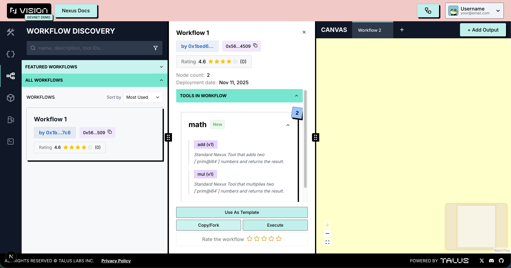

---
layout:
  width: default
  title:
    visible: true
  description:
    visible: false
  tableOfContents:
    visible: true
  outline:
    visible: true
  pagination:
    visible: true
  metadata:
    visible: true
---

# Workflow Discovery Tab

All deployed workflows are **accessible on-chain**. Under this tab, users can explore workflows previously deployed by other users.

Within the **Workflows Discovery tab**, users have access to the following features:

* **Featured Workflows:** Workflows frequently executed by other users
* **All User-Created Workflows:** Access to workflows created by other **Nexus** users
* **Workflow Details:** Information on tools used, deployment date, and workflow owner
* **Template Reuse:** Ability to use workflows again as templates
* **Easy Execution:** Simplified execution of workflows
    

    <figure><figcaption></figcaption></figure>
