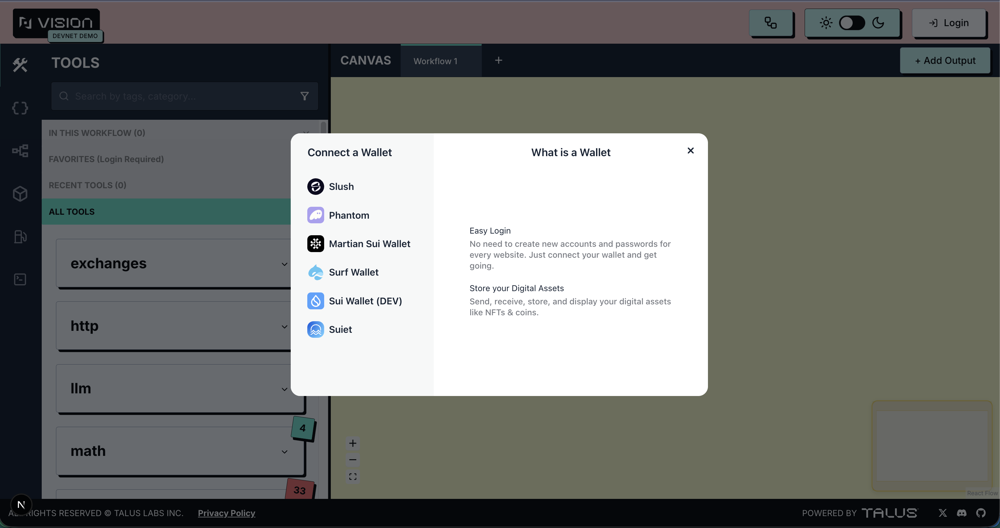

---
layout:
  width: default
  title:
    visible: true
  description:
    visible: false
  tableOfContents:
    visible: true
  outline:
    visible: true
  pagination:
    visible: true
  metadata:
    visible: true
---

# Connect with Sui Wallet

Talus Devnet Rpc : https://rpc.ssfn.devnet.production.taluslabs.dev \
Talus Devnet Explorer : https://explorer.devnet.taluslabs.dev/

For **Sui wallets** that support **custom RPC**, you can log in after configuring the network using the RPC information provided above.\
The **recommended wallet** for this process is [**Surf Wallet**](https://www.surf.tech/).

<figure><figcaption></figcaption></figure>

**Adding a Custom RPC for Slush Wallet**

After opening the Slush Wallet browser extension, go to the settings page located at the bottom right and the "Change Network" option should be clicked.

<figure><figcaption></figcaption></figure>

The "Custom RPC" option should be selected, and the Talus Devnet RPC should be added here.

<figure><figcaption></figcaption></figure>
