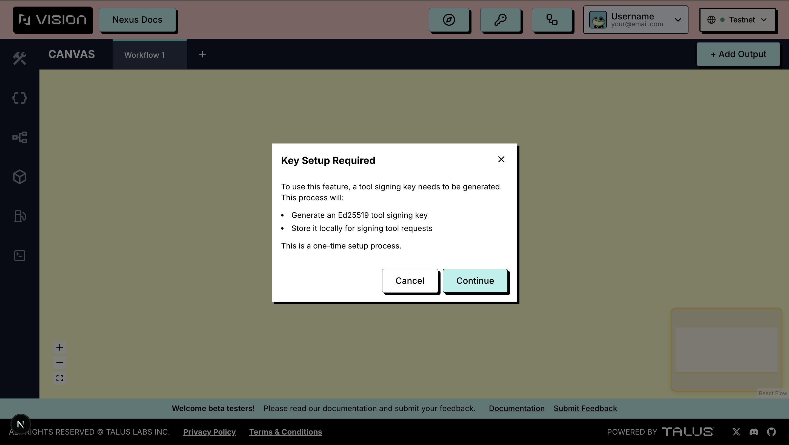

---
layout:
  width: default
  title:
    visible: true
  description:
    visible: false
  tableOfContents:
    visible: true
  outline:
    visible: true
  pagination:
    visible: true
  metadata:
    visible: true
---

# Crypto Features

Before you deploy or execute workflows, Talus Vision performs a one-time **Key Setup** in your browser. This generates a local **Ed25519 tool signing key** used to authenticate requests to off-chain Nexus tools. It is stored in your browser and is **not** sent to a server.

## Key Setup

After connecting your wallet, if Key Setup has not been completed, a **key icon** appears in the header. Click it to open the **Key Setup Required** dialog, then choose **Continue**. Talus Vision will:

1. Generate an Ed25519 tool signing key.
2. Store it locally for signing tool requests.

This is a one-time process and does **not** require a wallet transaction. Once complete, the key icon disappears from the header.

For more technical details, see the [Nexus CLI documentation](https://docs.talus.network/developer-docs/index-1/cli) (`nexus tool auth keygen`).

<figure><figcaption></figcaption></figure>
