---
layout:
  width: default
  title:
    visible: true
  description:
    visible: false
  tableOfContents:
    visible: true
  outline:
    visible: true
  pagination:
    visible: true
  metadata:
    visible: true
---

# Explorer

The **Explorer** is a built-in, on-chain browser for everything happening on the active Sui network. Open it from the **Explorer** button in the header and return to the playground at any time. All data reflects the currently selected network (Mainnet or Testnet) and refreshes automatically through live polling.

The Explorer navbar contains four tabs:

- **WORKFLOWS** — deployed DAG objects on the network
- **EXECUTIONS** — finished workflow runs
- **TASKS** — scheduled tasks created through the Execute Workflow tab
- **MY DASHBOARD** — your own workflows, executions, and tasks (visible only when a wallet is connected)

A chart icon in the navbar opens the **Analytics Dashboard** at `/explorer/dashboard`.

## Home

The Explorer landing page (`/explorer`) provides:

- **Global search** — look up any object ID (`0x…`), wallet address, or transaction digest. Results are typed (Workflow, Execution, Task, Profile, Transaction, or generic Object) and link directly to the matching detail page.
- **Stats** — for example, the number of registered tools on the network.
- **Live activity feed** — the most recent on-chain events, with new entries highlighted as they arrive.

<figure>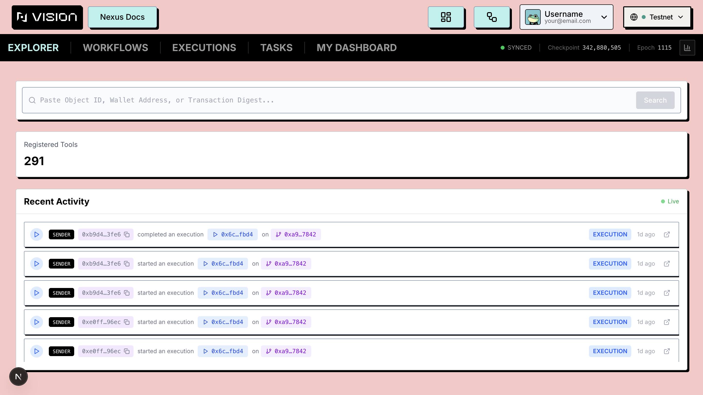<figcaption></figcaption></figure>

When you submit a search, a typed result card opens so you can jump straight to the matching detail page:

<figure>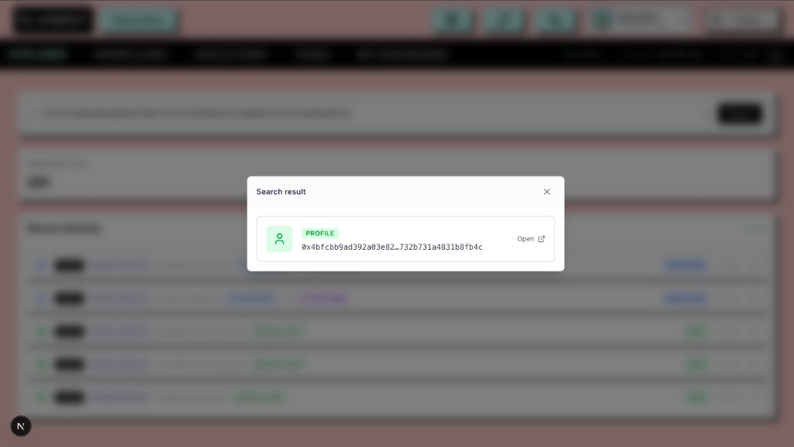<figcaption></figcaption></figure>

Each list tab and detail page also shows a **network status** indicator (sync state, checkpoint, epoch) and a **Refresh** control where applicable.

## Workflows

The **WORKFLOWS** tab lists deployed workflows (on-chain DAG objects) with infinite scroll and live polling.

Each card shows:

- **ID** — the workflow object ID (copyable)
- **Creator** — the owner address (copyable)
- **Created** — relative timestamp

<figure>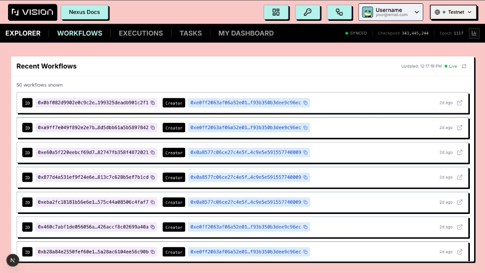<figcaption></figcaption></figure>

Click a card to open the workflow detail page (`/explorer/workflow/{dagId}`), which includes:

- A **read-only graph preview** of the deployed DAG (expandable to fullscreen)
- **Execution statistics** — total runs, unique executors, last activity
- An **execution history chart** over time
- A list of **executions** for this workflow; expand any row to inspect its transaction trace
- **Tools used** — the Nexus tools referenced by vertices in the DAG
- An **executor leaderboard** — addresses ranked by how often they ran this workflow

<figure>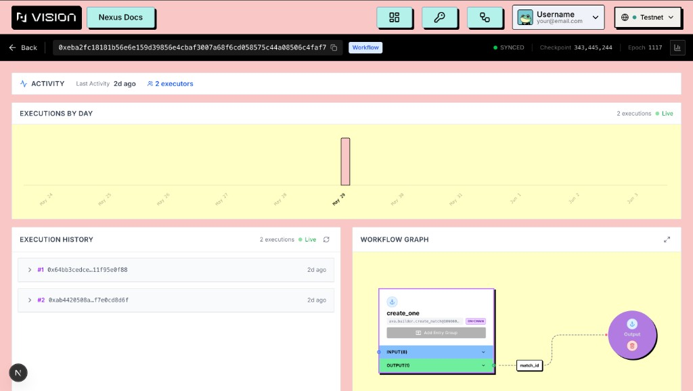<figcaption></figcaption></figure>

## Executions

The **EXECUTIONS** tab lists finished workflow executions discovered from on-chain `ExecutionFinished` events.

Each card shows:

- **Execution ID** and linked **Workflow ID** (both copyable)
- **Success / failure** status
- **Timestamp**

<figure>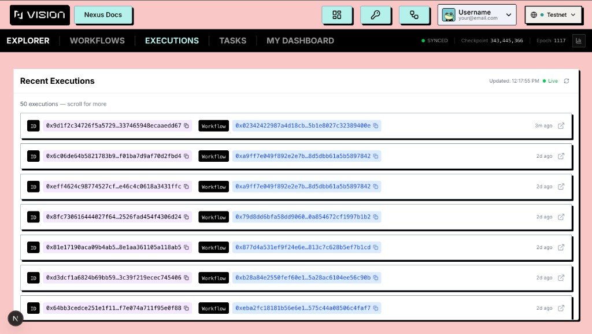<figcaption></figcaption></figure>

Click a card to open the execution detail page (`/explorer/execution/{executionId}`), which includes:

- Links to the parent **workflow** and related **transactions**
- **Execution statistics** — transaction count, success/failure breakdown, total gas spent
- **Execution Trace** — step-by-step path through the DAG with outputs at each vertex. Toggle between **Timeline** and **List** views. While a run is still in progress the trace shows an **In Progress** badge and updates live; completed runs show **Success** or **Failed**.

<figure>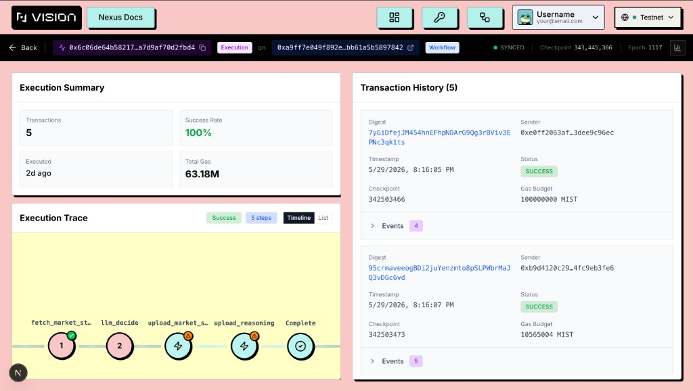<figcaption></figcaption></figure>

## Tasks

The **TASKS** tab lists scheduled tasks created on-chain through the [Execute Workflow](about-sidebar/execute-workflow-tab.md) tab in **Create Task** mode. Tasks are scheduler objects that trigger DAG executions either on a **Queue** (manual occurrences) or on a **Periodic** schedule.

### Task list

Each task card shows:

| Field | Description |
|-------|-------------|
| **ID** | On-chain task object ID (copyable) |
| **Creator** | Address that created the task |
| **Workflow** | The deployed DAG this task runs (copyable) |
| **Type** | **Queue** or **Periodic** |
| **Status** | **Active**, **Paused**, **Cancelled**, or **Unknown** |
| **Timestamp** | When the task was created |

The list supports infinite scroll, manual refresh, and live polling — new tasks appear at the top automatically.

<figure>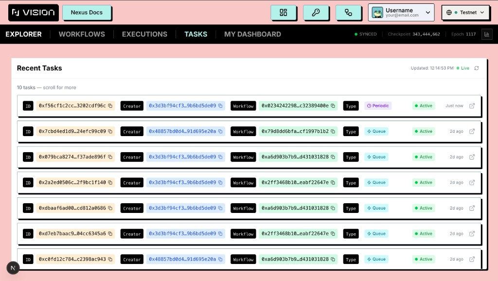<figcaption></figcaption></figure>

### Task detail page

Open any task at `/explorer/task/{taskId}`. The detail page is split by generator type.

#### Task Overview (all tasks)

Shared fields for every task:

- **Task ID**, **Creator**, and linked **Workflow**
- **Type** — Queue or Periodic
- **Status** — Active / Paused / Cancelled
- **Entry Group** — which entry group the task executes (when the DAG defines multiple)
- **Next Sequence** — for Queue tasks, the next occurrence sequence number

When present, additional sections show **Metadata** key/value pairs and **Input Data** (the port payloads submitted at task creation).

#### Queue tasks

Queue tasks run DAG executions one occurrence at a time, in order. After creating a Queue task in the playground you add occurrences manually from **My Tasks**.

On the detail page:

- A **queue animation** at the top visualizes pending, active, and completed occurrences moving through the queue
- **Queue Execution History** lists every occurrence in three groups:
  - **Active** — the occurrence currently being processed, with a countdown to its scheduled start time, start/deadline timestamps, and priority fee
  - **Pending** — upcoming occurrences waiting in the queue (collapsible)
  - **Executed** — completed occurrences with sender, timestamps, and a **View transaction** link to the on-chain tx digest

This history polls live so you can watch occurrences move from pending → active → executed.

<figure>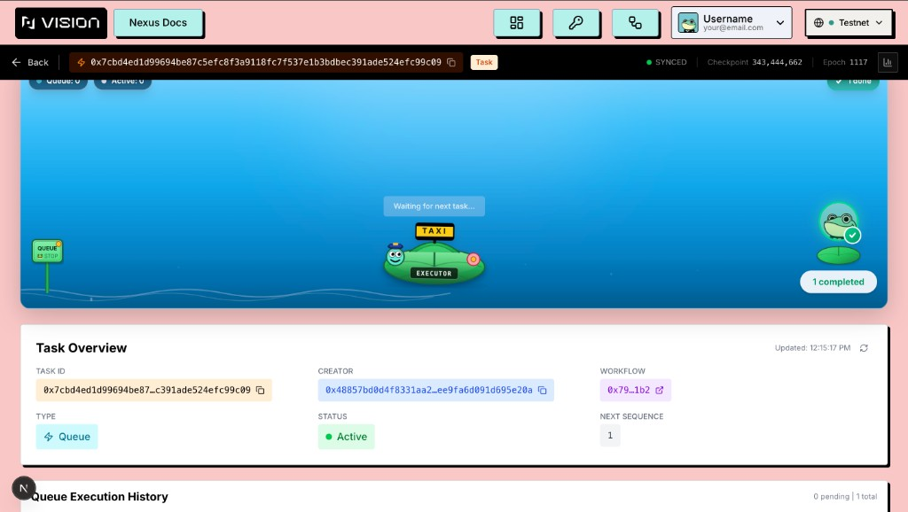<figcaption></figcaption></figure>

#### Periodic tasks

Periodic tasks generate occurrences automatically on a fixed interval.

The **Periodic Schedule** section shows:

- **Period** — time between runs
- **Max Iterations** — cap on total runs (or unlimited)
- **Priority Fee** — per-gas-unit fee set at task creation
- **Deadline Offset** — optional execution deadline
- **Generated Occurrences** — progress bar of runs completed vs. the maximum
- **First Start** and **Last Generated** timestamps

Periodic tasks do not show the queue animation or occurrence history cards; schedule configuration and progress are the primary view.

### Managing tasks from the playground

Task lifecycle actions (pause, resume, cancel, add occurrences, view queue) are performed from the **My Tasks** button in the [Execute Workflow](about-sidebar/execute-workflow-tab.md) tab, not from the Explorer. The Explorer is read-only for inspection and monitoring.

## My Dashboard

When a wallet is connected, the **MY DASHBOARD** tab opens your **Profile** page at `/explorer/profile/{yourAddress}`. It filters all three resource types to your address:

- **Workflows** — DAGs you deployed
- **Executions** — runs you initiated
- **Tasks** — scheduled tasks you created (full-width section below the two columns)

<figure>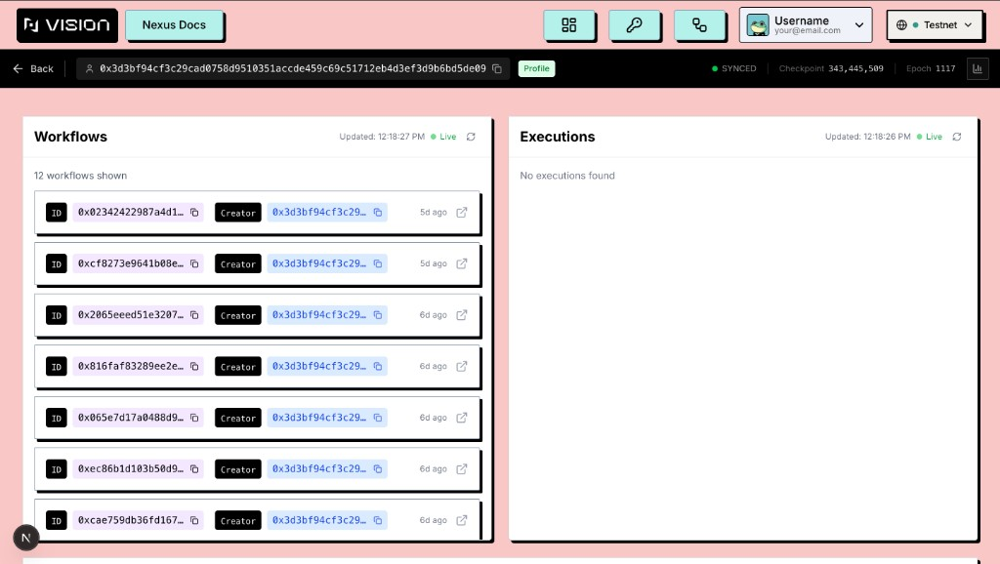<figcaption></figcaption></figure>

## Analytics Dashboard

The Analytics Dashboard (`/explorer/dashboard`) aggregates network activity over the most recent transactions (default window: last 1,000 tx). Use **Load More** to expand the sample.

**Activity Overview** — multi-series chart of Workflows, Executions, Tasks, and Gas over time, plus summary cards with sparkline trends:

<figure>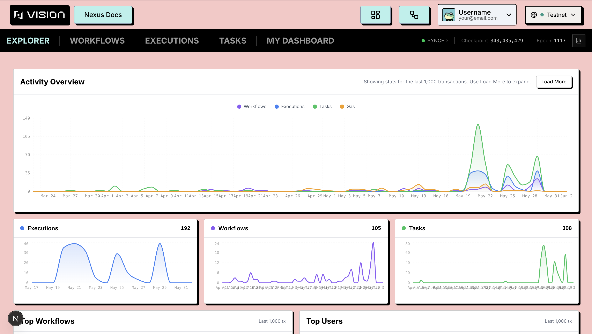<figcaption></figcaption></figure>

**Top Workflows**, **Top Users**, and **Recent Activity**:

<figure>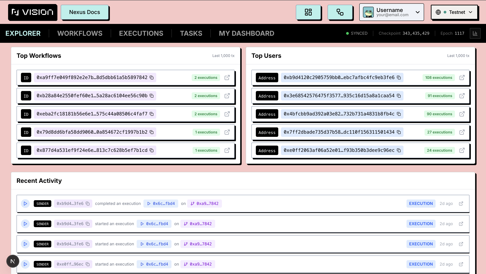<figcaption></figcaption></figure>

## Detail Pages

Beyond the list tabs, the Explorer provides dedicated detail pages. Each includes a **Back** action, a typed badge in the header bar (Workflow / Execution / Task / Profile / Transaction), copyable IDs, and the live network-status indicator.

| Route | What it shows |
|-------|---------------|
| `/explorer/workflow/{dagId}` | Deployed DAG graph, tools, execution history |
| `/explorer/execution/{executionId}` | Execution trace, transactions, gas stats |
| `/explorer/task/{taskId}` | Task overview, queue or periodic schedule |
| `/explorer/profile/{address}` | Filtered workflows, executions, and tasks for an address |
| `/explorer/tx/{digest}` | Transaction effects, events, and related objects |
| `/explorer/object/{objectId}` | Generic on-chain object inspection |

If a detail page cannot find its object (wrong network or invalid ID), it shows a **Not Found** message and redirects to the Explorer home after a short countdown.
