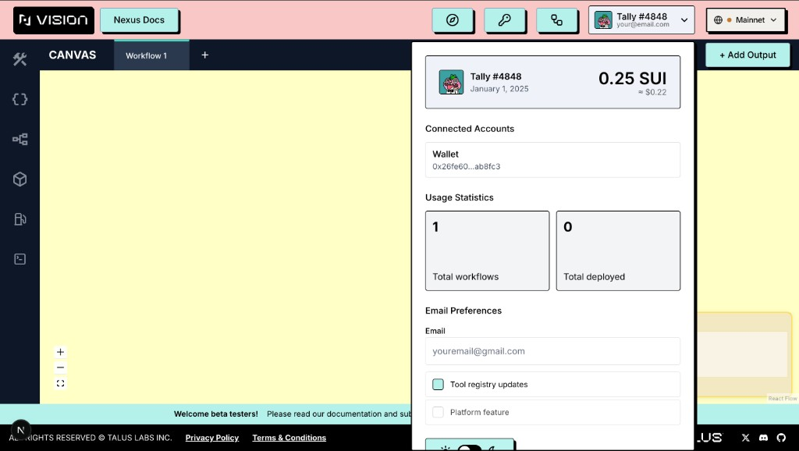

---
layout:
  width: default
  title:
    visible: true
  description:
    visible: false
  tableOfContents:
    visible: true
  outline:
    visible: true
  pagination:
    visible: true
  metadata:
    visible: true
---

# User Workflows & Profile

User activity within the application is continuously tracked. Draft workflows are saved per wallet and **per network**—your Testnet and Mainnet workspaces are kept separate.

## Profile Section (top-right corner)

Click your profile button in the header to open the account dropdown. It shows:

- Your wallet address and avatar
- Your **SUI balance** and approximate USD value
- **Usage statistics:** total draft workflows and total deployed workflows for the connected wallet on the active network
- Options to disconnect your wallet or delete your account (which clears local data and resets saved drafts)

### Tally NFT profile support

On **Sui Mainnet**, Talus Vision can personalize your profile using a **Tally** NFT from the *Tallys* collection if your connected wallet owns one in a Sui Kiosk.

| Network | Profile behavior |
| --- | --- |
| **Mainnet** | If you own at least one Tally NFT, Vision uses the **first** NFT returned by the wallet query for display |
| **Testnet** (and other networks) | NFT lookup is skipped; you see the default profile avatar and username |

**What changes when an NFT is detected**

- **Avatar** — taken from the NFT’s on-chain display metadata (`image_url`, or `thumbnail_url` as fallback). If metadata has no image, Vision falls back to the default Talus avatar.
- **Display name** — uses the NFT display name when present (e.g. `Tally #1234`). Otherwise a shortened form based on the object id, or the default username when no NFT is owned.

The profile button in the header and the **ProfileCard** inside the dropdown both use the same avatar and name, so your identity stays consistent across the UI.

<figure><figcaption></figcaption></figure>

**Requirements**

- Wallet connected on **Mainnet**
- At least one `Tally` object of type `…::nft::Tally` owned via Kiosk (standard collection deployment on mainnet)

NFT data is read-only: Vision does not transfer or list NFTs from the app. Disconnecting the wallet or switching to Testnet restores the default profile presentation.

### Tally tips (playground)

On the playground, occasional **Tip** banners may appear at the bottom of the layout (Tally character + short hint text). Tips auto-dismiss after a few seconds and respect a local cooldown so they are not shown on every visit. They are independent of NFT ownership—any user can see tips; NFT profile customization is separate.

## Workflows Navigation Button

The **Workflows** button in the header opens the **Workflows** page (`/workflows`), which contains two tabs:

### My Workflows

Displays workflows that are still being edited in the playground.  
Clicking a workflow loads it back into the playground for continued editing.

<figure><figcaption></figcaption></figure>

### Deployments

Shows workflows that have been deployed on-chain.  
Clicking a workflow opens it in **View Mode** within the playground, allowing users to inspect and interact with the deployed version.

<figure><figcaption></figcaption></figure>
