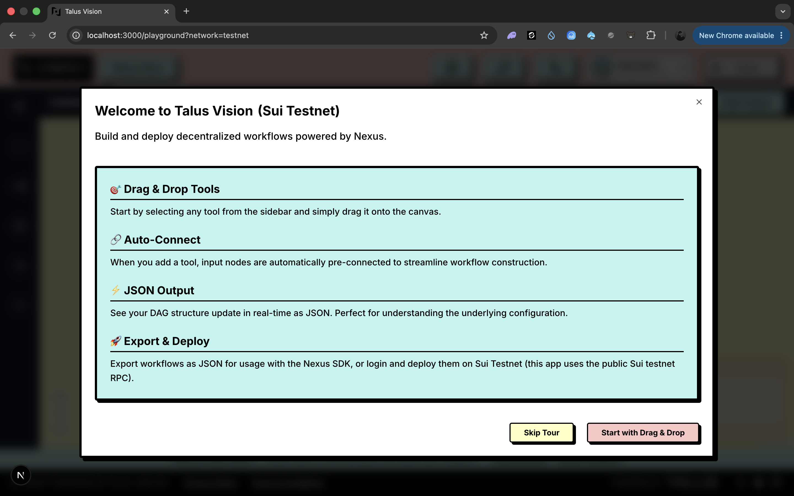
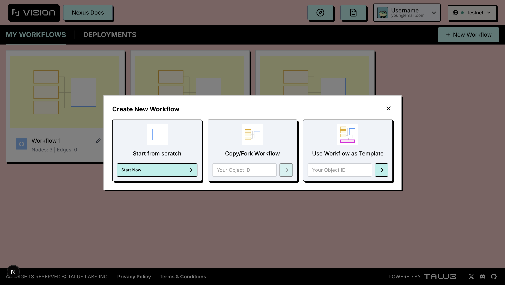

## Welcome to Talus Vision&#x20;

When you open the playground, a **"How would you like to start?"** dialog presents three options designed to help you create your first workflow with ease:

### 1. Blank Workflow

If you're already familiar with Talus Vision, you can start directly with an empty editor and build from scratch.

### 2. Quickstart Template

Loads a [sample template](https://docs.talus.network/getting-started/math-branching-quickstart) directly onto the canvas so you can quickly explore Talus Vision, and opens the matching guide in a new tab to help you understand the basics of Nexus and its workflow structure.

### 3. Browse Templates

Opens the **Workflow Discovery** tab, where you can review workflows previously created by other Nexus users and reuse any of them as templates for your own projects.

## Guided Tour

On your first visit, a **Welcome to Talus Vision** introduction appears first with a short overview of drag-and-drop, auto-connect, JSON output, and deployment. Choose **Start with Drag & Drop** to launch an interactive step-by-step tour of the playground, or **Skip Tour** to open the **"How would you like to start?"** dialog.

<figure><figcaption></figcaption></figure>

## What Happens Next

Once you choose an option, Talus Vision opens the workflow canvas, where you can start building or exploring. You can also access your previously deployed or saved workflows at any time from the header **Workflows** button or the sidebar.

<figure><figcaption></figcaption></figure>
